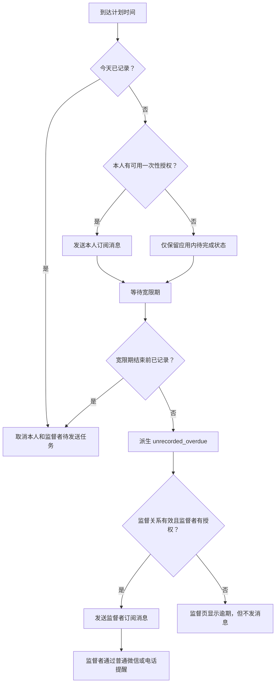
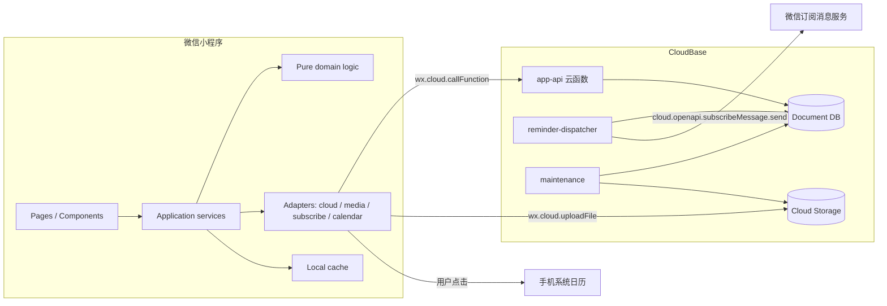

# 避孕药记录小程序 MVP Spec

| 项目 | 内容 |
|---|---|
| 文档状态 | Draft for implementation |
| 目标版本 | MVP v0.1 |
| 目标用户 | 产品本人及少量受邀朋友 |
| 客户端 | 微信原生小程序 + TypeScript |
| 后端 | 微信云开发 / CloudBase |
| 默认方案 | 21 天服药 + 7 天停药，底层参数化 |
| 身份方式 | 小程序上下文中的 `OPENID`，无显式登录页 |
| 提醒方式 | 一次性订阅消息 + 系统日历兜底 + 监督者人工提醒 |
| 上游研究 | [PRODUCT_AND_TECH_RESEARCH.md](../research/PRODUCT_AND_TECH_RESEARCH.md) |

## 1. 文档目的

本文承接现有产品与技术研究结论，[^1]把产品方向转化为可以直接进入设计、开发、测试和验收的实现规格，重点回答四个问题：

1. 用户在每个页面能看到什么、能做什么；
2. 21+7 周期、记录、照片和监督关系如何建模；
3. 在微信小程序能力边界内，提醒怎样尽量可靠且不误发；
4. 第一版的客户端、云函数、数据库和云存储怎样组织。

本文不提供医疗判断。程序只展示计划、提醒和记录事实，不判断避孕是否有效，也不自动给出漏服后的处置方案。发生漏服或不确定情况时，界面统一提示用户查看对应药品说明书或咨询医生。

## 2. 执行摘要

MVP 的核心闭环是：

```text
建立 21+7 方案
  → 今日页明确“吃药日 / 停药日”
  → 到点收到可用的微信订阅消息和系统日历提醒
  → 以“今日拍照片”为主操作确认已服
  → 记录服务端时间并续订下一次微信提醒
  → 宽限期后仍未记录时通知已授权的监督者
  → 监督者通过普通微信聊天或电话继续提醒
```

MVP 不承诺像原生闹钟一样持续响铃。一次性订阅消息是“一次授权对应一次可发送机会”，小程序也不能依赖后台页面代码长期运行。因此，可靠性来自多层组合，而不是绕过微信规则反复推送：

- 小程序内的明确日历和未完成状态；
- 每日记录动作后续订下一次订阅消息；
- 用户主动写入手机系统日历的提醒；
- 逾期后通知监督者，再由人通过微信或电话提醒。

客户端采用微信原生 TypeScript，而不在第一版引入 Taro、uni-app 或复杂状态管理框架。微信小程序本身是渲染层与逻辑层分离的双线程模型，页面渲染通过 WXML/WXSS，业务逻辑运行于 JSCore，二者经微信 Native 通信；这一点决定了页面应保持轻量，并避免把高频、大对象反复通过 `setData` 传给渲染层。[^2][^4]

后端采用与小程序原生打通的 CloudBase：客户端用 `wx.cloud.callFunction` 调用云函数，云函数用 `cloud.getWXContext()` 获取由平台透传的 `OPENID`。客户端不提交、服务端也不信任任何自称的用户 ID，因此不需要额外的“微信登录”按钮或自建 token 系统。[^11]

## 3. 产品目标与非目标

### 3.1 MVP 目标

- 用户在 3 秒内判断今天是服药日还是停药日。
- 用户在今日页一眼看到是否已经记录，以及服务端确认的记录时间。
- “今日拍照片”始终是服药日尚未完成时最醒目的主操作。
- 用户能在没有照片或照片上传失败时继续确认服药。
- 用户可看到完整的 21+7 月历状态，不靠自己计算停药期。
- 用户能通过真实点击获得一次性订阅消息授权，并在每次记录时自然续订下一次提醒。
- 最多邀请 3 位监督者；逾期未记录时，在双方授权和微信可发送的前提下通知监督者。
- 提醒、记录、邀请领取和方案修改在并发与重试下不会制造重复记录或明显误发。
- 照片默认只有服药用户本人可见。

### 3.2 MVP 非目标

- 不诊断、不提供个体化用药建议，不计算避孕成功率。
- 不对接医院、药店、电子处方或在线问诊。
- 不获取手机号、身份证、微信昵称或头像。
- 不支持多个药物同时管理。
- 不支持跨微信 AppID 的统一账号体系。
- 不做面向公众的动态、社区、排行榜或照片分享。
- 不承诺无限、持续或一定送达的微信消息。
- 不建设独立运营后台；第一版仅依赖 CloudBase 控制台与结构化日志排查问题。

### 3.3 成功指标

小范围 MVP 的首要指标不是日活，而是闭环可靠性：

| 指标 | 目标 |
|---|---:|
| 已配置用户当天状态计算正确率 | 100%（以测试用例覆盖的规则为准） |
| 记录成功后再次打开仍能看到同一结果 | 100% |
| 重复点击产生多条服药记录 | 0 |
| 订阅授权失败导致服药记录失败 | 0 |
| 已在宽限期内记录却仍创建新的监督者提醒 | 0 |
| 监督者读取照片 | 0 |
| 具备授权且微信接口正常时，任务在目标时间后 2 分钟内开始发送 | ≥ 95% |

最后一项是“本系统开始调用微信发送接口”的内部 SLO，不是对微信最终通知到达、响铃或用户阅读的保证。

## 4. 用户与权限

### 4.1 角色

| 角色 | 说明 | 主要权限 |
|---|---|---|
| 服药用户 `owner` | 建立方案并记录服药的人 | 管理自己的方案、记录、照片、提醒和监督关系 |
| 监督者 `caregiver` | 通过邀请加入的可信任朋友 | 查看被授权的状态；选择接收一次逾期消息；退出关系 |

同一个微信用户可以在自己的方案中是 `owner`，同时在别人的关系中是 `caregiver`。

### 4.2 无显式登录

首次进入时直接调用 `bootstrap` 云函数：

1. 云函数从 `cloud.getWXContext()` 读取 `OPENID` 和 `APPID`；
2. 计算内部 `userId`，不存在则创建最小用户记录；
3. 返回该用户的初始化状态；
4. 没有方案则进入设置引导，有方案则进入今日页。

禁止以下实现：

- 客户端把 `openId`、`userId` 或 `ownerId` 作为可信身份传入；
- 为了“登录”而申请昵称、头像或手机号；
- 把 `OPENID` 输出到客户端日志、埋点或错误文案；
- 同一个云函数同时开放小程序事件调用和无身份的 HTTP 调用。CloudBase 文档提示，依赖 `getWXContext()` 的函数应保持调用来源单一，避免实例复用和混合入口带来的身份风险。[^16]

### 4.3 权限矩阵

| 资源 | owner | caregiver | 未建立关系的人 |
|---|---:|---:|---:|
| 自己的用户设置 | 读写 | 不适用 | 无 |
| 服药方案 | 读写 | 只读最小摘要 | 无 |
| 今日状态 | 读写 | 只读 | 无 |
| 历史状态 | 读写 | 只读最近 30 天 | 无 |
| 照片 | 读写/删除 | 无 | 无 |
| 监督关系 | 邀请/撤销 | 领取/退出 | 无 |
| 提醒授权 | 管理自己的授权 | 管理自己的授权 | 无 |

所有数据库集合对普通客户端设置为“仅管理端可读写”，读写统一走云函数。CloudBase 的安全规则可以基于 `auth.openid` 做文档级隔离，但涉及健康记录、监督关系和跨用户读取时，云函数集中鉴权更容易审计，也能在一个服务端事务内完成多集合写入。[^12][^13]

## 5. 信息架构

### 5.1 页面清单

| 页面 | 路由建议 | 是否 Tab | 目的 |
|---|---|---:|---|
| 启动页 | `pages/launch/index` | 否 | 初始化云环境、调用 bootstrap、路由分流 |
| 设置方案 | `pages/onboarding/index` | 否 | 首次建立方案和提醒偏好 |
| 今日 | `pages/today/index` | 是 | 明确今日任务，拍照或无照片记录 |
| 日历 | `pages/calendar/index` | 是 | 查看 21+7 周期和历史状态 |
| 监督 | `pages/care/index` | 是 | 邀请、查看与撤销监督关系 |
| 设置 | `pages/settings/index` | 是 | 修改方案、提醒、隐私和数据 |
| 记录确认 | `pages/record/index` | 否 | 预览照片并完成确认 |
| 邀请领取 | `pages/invite/index` | 否 | 预览并领取监督邀请 |
| 监督详情 | `pages/care-detail/index` | 否 | 监督者查看某位朋友的状态 |

### 5.2 Tab 结构

```text
今日        日历        监督        设置
```

今日、日历、监督、设置均是主包页面。Tab 页面在切换后通常保留实例并重新触发 `onShow`，因此“刷新服务端状态”放在 `onShow`，`onLoad` 只做一次性参数解析和对象初始化。[^3]

### 5.3 今日页低保真结构

```text
┌────────────────────────────┐
│ 9 月 9 日 · 本周期第 8/28 天       │
│                            │
│        今天需要服药             │
│        计划时间 22:30           │
│                            │
│ ┌────────────────────────┐ │
│ │       📷 今日拍照片          │ │  ← 第一视觉按钮
│ └────────────────────────┘ │
│        无照片确认已服           │  ← 次要文字按钮
│                            │
│ 微信提醒：下一次已续订 / 未续订     │
│ 系统日历：已覆盖至 11 月 3 日       │
│                            │
│ [服药说明] 今天尚未记录            │
└────────────────────────────┘
```

已记录状态：

```text
┌────────────────────────────┐
│        ✓ 今天已记录             │
│        22:37 · 有照片           │
│                            │
│      [查看照片]  [修正记录]       │
│                            │
│ 下一次微信提醒：9 月 10 日 22:30   │
└────────────────────────────┘
```

停药日状态：

```text
┌────────────────────────────┐
│        今天是停药日             │
│        无需记录服药              │
│                            │
│ 下次服药：9 月 30 日 22:30        │
│ [查看完整周期]                   │
└────────────────────────────┘
```

### 5.4 日历页低保真结构

```text
┌────────────────────────────┐
│ ‹  2026 年 9 月  ›               │
│ 一  二  三  四  五  六  日        │
│     1  2  3  4  5  6            │
│ 7  8  ●  ✓  ✓  !  ○            │
│ ...                            │
│                            │
│ ● 今天待服  ✓ 已服  ! 逾期未记录   │
│ ○ 停药日    — 方案外日期          │
│                            │
│ 9 月 9 日 · 应服药                │
│ 状态：尚未记录                    │
└────────────────────────────┘
```

### 5.5 监督页低保真结构

Owner 视角：

```text
┌────────────────────────────┐
│ 监督我的人                    │
│                            │
│ 小雨   已加入   逾期提醒：已授权     │
│ 阿哲   已加入   逾期提醒：未续订     │
│                            │
│ ┌────────────────────────┐ │
│ │       邀请一位朋友           │ │
│ └────────────────────────┘ │
│ 最多 3 人                     │
└────────────────────────────┘
```

Caregiver 视角：

```text
┌────────────────────────────┐
│ 我在监督                      │
│                            │
│ Joyce                        │
│ 今天 22:30 应记录 · 尚未到时间     │
│ [查看详情]                    │
│                            │
│ 仅显示记录状态，不显示照片          │
└────────────────────────────┘
```

## 6. 核心用户流程

### 6.1 首次设置

步骤：

1. 进入小程序，静默建立内部用户。
2. 选择方案：默认“21 天服药 + 7 天停药”。
3. 选择当前药板第一天的日期。
4. 选择每日计划时间，默认 `22:30`。
5. 选择逾期宽限期，默认 `60` 分钟，可选 30/60/120 分钟。
6. 填写可选称呼，用于监督者界面；未填写时显示“一位朋友”。
7. 点击“保存并开启下一次微信提醒”。
8. 在该点击事件中调用 `wx.requestSubscribeMessage`。
9. 不论同意、拒绝还是调用失败，方案均正常保存。
10. 如果模板结果为 `accept`，独立调用 `subscription.register`；登记失败不回滚方案，并提供重试同步。
11. 展示“添加到系统日历”可选项，不自动写入。

验收标准：

- 方案保存和订阅授权是两个独立结果；任何消息授权错误都不回滚方案。
- 开始日期晚于今天时，今日页显示“方案尚未开始”。
- 开始日期早于今天时，正确计算今天在周期中的位置。

### 6.2 拍照确认已服

步骤：

1. 用户点击今日页主按钮“今日拍照片”。
2. 调用 `wx.chooseMedia`，参数为 `count: 1`、`mediaType: ['image']`、`sourceType: ['camera']`、`sizeType: ['compressed']`。该接口返回临时文件路径和大小，正式版调用前必须在隐私保护指引中声明“选中的照片或视频信息”。[^8][^10]
3. 打开记录确认页，展示照片预览、今天日期和计划时间。
4. 用户点击“确认已服并续订下一次提醒”。
5. 同一个用户点击事件首先调用 `wx.requestSubscribeMessage`；读取该模板 ID 对应的 `accept/reject/ban/filter`，不能只看整体 `errMsg`。当前官方文档允许单次最多传入 5 个模板 ID，但 MVP 只请求一个自用提醒模板；一次性与长期模板不能混用。[^5]
6. 无论订阅结果如何，调用 `media.prepareUpload`，上传压缩图，再携带上传票据调用 `dose.confirm`。
7. 云函数用服务端时间写入记录，并幂等更新当天唯一 occurrence。
8. 如果订阅结果为 `accept`，独立调用 `subscription.register`；即使该调用失败，服药记录仍然成功。
9. 返回今日页，显示服务端确认时间和下一次提醒覆盖状态。

失败处理：

- 用户取消拍照：留在今日页，不生成记录。
- 照片过大：客户端压缩；仍超过 5 MB 时提示重拍或无照片确认。
- 上传失败：提供“重试上传”和“无照片确认已服”，不把临时草稿显示为已完成。
- 云函数超时但结果未知：用同一 `requestId` 查询/重试；服务端幂等返回同一 occurrence，不新建第二条记录。
- 已存在已服记录：上传图作为该记录的照片补充或替换，不产生第二次“已服”。替换前二次确认，旧文件在新记录提交成功后异步删除。

### 6.3 无照片确认已服

1. 用户点击次要操作“无照片确认已服”。
2. 弹出轻确认：“确认今天已经服用？记录时间将以服务器时间为准。”
3. 点击“确认已服并续订提醒”后，先请求一次性订阅，再调用 `dose.confirm`。
4. 保存 `evidenceType = none`；订阅结果为 `accept` 时再独立调用 `subscription.register`。

无照片记录在状态语义上仍是 `taken`，界面只额外标注“无照片”。照片是证据附件，不是完成状态的必要条件。

### 6.4 明确记录未服

入口位于今日页“更多”菜单，避免与主操作同等突出。

1. 用户选择“记录今天未服”。
2. 展示确认文案：“这会记录事实，但不会给出医疗处理建议。”
3. 保存 `actualStatus = not_taken`。
4. 界面显示“已记录未服”，并提示查看药品说明书或咨询医生。
5. 对监督者而言，这与“系统不知道是否服用”的 `unrecorded_overdue` 明确区分。

### 6.5 补记与修正

记录时间不等于实际服药时间，界面始终写“记录于”，不写“服用于”。如果用户跨过午夜才想起昨天已经服用：

1. 今日页在昨天是 active 且仍无记录时显示“昨天尚未记录”的次级入口；
2. 用户也可从日历点选最近 7 天的 active 日期；
3. 无记录时走 `dose.backfill`，已有记录时走 `dose.correct`；
4. 服务端保留目标 `localDate`，但 `recordedAt` 仍使用当前服务端时间，并写入 `recordingMode = backfill`；
5. 历史显示“补记于 X 月 X 日 HH:mm”，不伪造为计划时间完成；
6. 已经发送的本人或监督者消息无法撤回，修正只影响之后的页面状态。

普通今日确认不接受客户端任意指定日期；只有从日历/昨日补记入口发起、且目标日期通过 7 天窗口和方案 active 校验时，服务端才接受 `targetLocalDate`。

### 6.6 邀请监督者

1. Owner 点击“邀请一位朋友”。
2. 云函数使用服务端密钥和 `ownerUserId + requestId` 确定性派生至少 128 bit 的不可预测 token，只保存 token 哈希，默认 48 小时过期、单次领取；同一 requestId 重试可重新得到同一个原 token。
3. 页面通过 `button open-type="share"` 分享路径 `pages/invite/index?t=<rawToken>`。只有页面定义 `onShareAppMessage` 后，右上角转发才会出现；回调可自定义转发路径。[^17]
4. 接收者进入邀请页；`onLoad` 只读取 query，调用 `care.invite.preview` 获取脱敏摘要。
5. 接收者点击“加入监督并接收一次逾期提醒”。
6. 同一点击事件请求监督者消息模板，然后调用 `care.invite.claim`。
7. 云函数事务内验证 token、过期时间、是否已领取、人数上限和不能监督自己，再建立关系。
8. 若模板结果为 `accept`，独立调用 `subscription.register`；登记失败不回滚关系。
9. 订阅拒绝不阻止加入；界面提示“你可以查看状态，但暂时收不到微信逾期提醒”。

### 6.7 逾期升级



发送前必须再次读取当天记录与监督关系，以处理“用户刚记录”“关系刚撤销”的竞态。

## 7. 状态与领域规则

### 7.1 计划状态

| 状态 | 含义 |
|---|---|
| `before_start` | 方案尚未开始 |
| `active` | 当天计划服药 |
| `break` | 当天计划停药 |
| `paused` | 方案已暂停 |
| `after_end` | 方案已结束；MVP 通常为无限循环，不主动出现 |

### 7.2 实际记录状态

| 状态 | 来源 | 含义 |
|---|---|---|
| `none` | 存储值 | 尚无用户记录 |
| `taken` | 用户记录 | 已确认服用 |
| `not_taken` | 用户记录 | 明确记录未服 |

`late` 不单独作为可写事实，而是派生属性：

```text
actualStatus == taken
AND recordedAt > plannedAt + lateThreshold
```

MVP 中 `lateThreshold = 0`，即计划时间后记录即显示“晚于计划时间记录”；它只是描述记录时间，不代表医学上的“漏服”或“避孕效果下降”。

### 7.3 页面派生状态

按以下优先级计算：

1. `before_start / paused / break`；
2. `taken`；
3. `not_taken`；
4. 当前时间小于 `plannedAt`：`future`；
5. 当前时间小于等于 `plannedAt + graceMinutes`：`due_unrecorded`；
6. 超过宽限期：`unrecorded_overdue`。

`not_taken` 永远不能被展示成 `unrecorded_overdue`，因为前者是明确事实，后者是信息缺失。

### 7.4 唯一服药事件

一个方案版本在一个本地日期最多有一个 occurrence：

```text
occurrenceId = SHA-256(regimenVersionId + ":" + localDate)
```

所有重复点击、网络重试和照片补传都更新同一个 occurrence。状态修改同时追加不可变事件：

```text
dose_record_events:
  confirmed_taken
  marked_not_taken
  evidence_attached
  evidence_replaced
  evidence_deleted
  record_corrected
```

当前页读取 `dose_records` 投影，历史纠错读取 `dose_record_events`。这样既避免每次查询都重放事件，也保留“何时修正过”的证据。

## 8. 周期与时间算法

### 8.1 方案参数

```ts
type RegimenVersion = {
  id: string
  startDate: string          // YYYY-MM-DD，方案时区中的日历日期
  activeDays: number         // MVP 默认 21
  breakDays: number          // MVP 默认 7
  scheduledLocalTime: string // HH:mm
  timezone: string           // MVP 默认 Asia/Shanghai
  graceMinutes: number       // 默认 60
  effectiveFrom: string      // YYYY-MM-DD
  status: 'active' | 'paused' | 'superseded'
}
```

约束：

- `1 <= activeDays <= 365`
- `0 <= breakDays <= 365`
- `activeDays + breakDays <= 366`
- `scheduledLocalTime` 必须符合 24 小时制 `HH:mm`
- `graceMinutes` 第一版限制在 `15..360`
- MVP 界面只展示 21+7 预设和“自定义”入口；底层不得写死 21、7。

### 8.2 日期计算

```ts
function cycleDay(startDate: LocalDate, targetDate: LocalDate, a: number, b: number) {
  const offset = differenceInCalendarDays(targetDate, startDate)
  if (offset < 0) return { planStatus: 'before_start' }

  const length = a + b
  const dayIndex = ((offset % length) + length) % length
  return {
    planStatus: dayIndex < a ? 'active' : 'break',
    cycleDay: dayIndex + 1,
    cycleLength: length,
  }
}
```

实现要求：

- `YYYY-MM-DD` 先解析为年、月、日，再用 UTC calendar arithmetic 计算相隔天数；
- 禁止直接用两个本地 `Date` 对象的毫秒差除以 `86400000`；
- 普通今日写入由服务端按方案时区计算 canonical `localDate`；
- 只有显式的补记/修正 action 可提交 `targetLocalDate`，服务端必须验证其处于最近 7 天、属于该用户方案且为 active 日期；
- 客户端上传的 `clientLocalDate` 只用于排错，不决定普通今日 occurrence；
- `recordedAt` 使用服务端时间；客户端时间仅可展示“设备时间与服务器偏差较大”的提示；
- 从后台回到前台时用 `onShow` 重新拉取 `serverNow` 和今日状态，处理跨午夜变化。
- 监督者页面与消息中的日期、计划时间统一使用 owner 的方案时区，而不是监督者手机当前时区；跨时区时显式显示时区名称。
- 旅行时不跟随手机时区自动改变方案，以免无提示地移动计划时间；用户主动改时区时创建新方案版本。

### 8.3 修改方案

不修改旧版本，不重写历史记录：

1. 用户在设置页编辑方案；
2. 默认次日本地 `00:00` 生效；
3. 云函数创建新的 `regimenVersion`；
4. 原版本标记 `superseded` 并写入 `effectiveTo`；
5. 取消原版本尚未发送的提醒任务；
6. 从新版本创建下一次提醒任务。

若用户选择“今天生效”，必须二次确认，并保留当天已经存在的实际记录，不自动删除或迁移照片。

### 8.4 暂停与恢复

- 暂停只影响将来日期，不删除历史。
- 暂停后所有未发送提醒任务置为 `skipped_plan_paused`。
- 恢复时默认让用户重新选择“新周期第一天”，创建新方案版本；不尝试猜测旧周期应该继续到第几天。

## 9. 微信提醒设计

### 9.1 能力边界

`wx.requestSubscribeMessage` 从基础库 2.8.2 起必须在用户点击或支付回调后调起。用户勾选“总是保持以上选择”后，后续请求可能不再弹窗并沿用选择；用户也可以在小程序设置中修改。一次请求的成功回调会分别给每个模板返回 `accept`、`reject`、`ban` 或 `filter`。[^5][^6]

订阅消息必须由服务端发送。微信提供 HTTPS 服务端接口，CloudBase 云函数也可直接调用 `cloud.openapi.subscribeMessage.send`；请求至少包含接收者 `OPENID`、模板 ID、跳转页面和模板数据。[^7]

因此 MVP 采用以下规则：

- 只使用一次性订阅模板，不假设拥有长期订阅资格；
- 本人模板与监督者模板分开配置；
- 每次“保存方案”“确认已服”“监督者加入”或“监督者查看一次逾期详情后继续接收”均可在对应点击上请求一次；
- 消息授权失败永远不阻塞核心业务写入；
- 客户端上报的 `accept` 只是本地授权账本依据，真正发送结果以微信服务端接口为准；
- 不通过重复模板、同标题模板或诱导点击来囤积多次发送额度；
- 不把订阅消息描述成闹钟或保证送达。

凡是“核心动作 + 续订提醒”的按钮都采用同一协调顺序：在点击处理函数中立即发起订阅请求，再分别提交核心业务和 `subscription.register`。两者不做跨接口分布式事务：核心业务成功而授权登记失败时只提示“记录已保存，提醒同步失败”；核心业务失败但授权已接受时仍尝试登记这次 grant，避免浪费用户已经给出的发送机会。

模板结果一旦为 `accept`，客户端先把 `{requestId, templateKey, source, acceptedAt}` 写入一个不含敏感数据的小型本地待同步队列，再调用 `subscription.register`；服务端确认后移除。下次 `onShow/bootstrap` 可重试 7 天内的待同步项，服务端按 requestId 幂等并受每日限频约束。该队列只代表“待登记授权”，不能让任何服药记录显示为成功。

### 9.2 模板配置

环境变量：

```text
SUBSCRIBE_TEMPLATE_SELF_DUE
SUBSCRIBE_TEMPLATE_CARE_OVERDUE
MINIPROGRAM_STATE=developer|trial|formal
```

代码中只引用语义 key，不散落真实模板 ID。模板字段必须在小程序后台选定模板后建立版本化映射，例如：

```ts
const templateMappings = {
  SELF_DUE_V1: {
    templateId: env.SUBSCRIBE_TEMPLATE_SELF_DUE,
    fields: {
      thing1: '每日记录提醒',
      time2: plannedLocalTime,
      thing3: '请进入小程序确认今天是否完成',
    },
  },
}
```

实际 keyword 名称和类型以微信公众平台可选模板为准，未完成真机模板验证前不得把占位字段发布到正式环境。

隐私默认：

- 锁屏可能显示通知内容，因此默认标题使用“每日记录提醒”，不直接出现“避孕药”；
- 监督者消息使用用户自定义称呼或“一位朋友”，不显示药物名称、照片或详细医疗信息；
- 跳转页打开后仍由云函数根据当前 `OPENID` 校验权限。

### 9.3 授权账本

微信不会给出可供业务使用的独立 grant ID，服务端维护自己的近似账本：

```ts
type SubscriptionGrant = {
  _id: string
  recipientUserId: string
  templateKey: 'SELF_DUE' | 'CARE_OVERDUE'
  templateId: string
  status: 'available' | 'reserved' | 'consumed' | 'invalid'
  source: 'onboarding' | 'dose_confirm' | 'care_join' | 'care_detail'
  clientResult: 'accept'
  reservedJobId?: string
  acceptedAt: ServerDate
  consumedAt?: ServerDate
  invalidReason?: string
}
```

只有模板结果明确为 `accept` 时创建一条 `available` grant。由于第一版不接订阅行为事件回调，这个账本不是微信侧额度的绝对真相：若发送返回“用户拒绝或一次性额度已耗尽”，服务端立即将对应 grant 标记 `invalid` 并刷新界面覆盖状态。

### 9.4 任务调度

不为每位用户创建一个定时器。使用一个每分钟执行的 `reminder-dispatcher`：

1. 查询 `status = pending AND scheduledAt <= now` 的任务，按时间升序取小批次；
2. 以事务/条件更新把任务改为 `claimed`，写入 `leaseUntil` 和随机 `claimToken`；
3. 根据任务种类再次检查方案版本、当天记录、监督关系和 grant；
4. `overdue_check` 不发消息：若仍未记录，则为有效监督关系生成 `care_overdue` 消息任务；无论本次是否已经记录，最后都链式创建下一个 active occurrence 的 `overdue_check`；
5. 消息任务不再满足条件时标记 `skipped_*`，不调用微信接口；
6. 满足条件时调用 `cloud.openapi.subscribeMessage.send`；
7. 根据确定结果写入 `sent`、`terminal_failed` 或释放为 `pending`；
8. 租约超时的 `claimed` 任务由下一轮恢复检查。

CloudBase 定时触发器使用七段 cron；官方资料明确提示在发布升级、节点切换等边缘情况下可能短时间重复触发，业务必须自行幂等。[^14]

建议触发器：

```json
{
  "triggers": [
    {
      "name": "dispatch-every-minute",
      "type": "timer",
      "config": "0 * * * * * *"
    }
  ]
}
```

上线前必须在控制台确认触发器时区。所有任务的 `scheduledAt` 存 UTC 时间戳，cron 只负责“每分钟唤醒”，不负责理解用户时区。

### 9.5 幂等与并发

任务 ID 为确定性哈希：

```text
jobId = SHA-256(
  targetUserId + ":" + (templateKey ?? "NONE") + ":" + occurrenceId + ":" + stage
)
```

`stage` 第一版只有：

- `self_due`
- `overdue_check`
- `care_overdue`

同一个接收者的任务串行发送，避免微信错误码 `43108` 所代表的同用户并发发送问题。微信服务端还可能返回用户未订阅/额度耗尽、模板能力被封禁、敏感词或模板数据不合法等错误；这些错误要分成业务终态、配置终态和可安全重试三类。[^7]

| 类型 | 示例 | 处理 |
|---|---|---|
| 业务终态 | `43101` 用户未订阅或额度耗尽 | grant 置为 invalid；任务终止；界面提示续订 |
| 配置终态 | `43107` 能力/模板被封、`45168` 敏感词、`47003` 参数不符合模板 | 任务终止；结构化告警；不得循环重试 |
| 明确暂态 | 限流或平台明确表示未受理 | 指数退避，最多 3 次 |
| 并发冲突 | `43108` | 同 recipient 串行化，短延迟后重试 |
| 网络超时、结果未知 | 没有明确发送结果 | 任务标记 `unknown`，grant 标记 `invalid: send_outcome_unknown`，不自动重发 |

微信发送 API 没有业务方可传入的幂等键，因此“请求超时但可能已经发送”无法做到严格 exactly-once。MVP 的原则是：确定未受理才重试，结果未知不自动重发；后台日志保留 `requestId/jobId` 供排查。

### 9.6 下一次提醒的分配

每次获得本人 `SELF_DUE` grant 后：

1. 找到当前方案下最早的、尚未记录的 active occurrence；
2. 若今天尚未到计划时间，优先覆盖今天；
3. 若今天已记录或已过计划时间，覆盖下一个 active 日期；
4. 停药期自动跳到下一周期第一天；
5. 事务内把 grant 置为 `reserved` 并 upsert 唯一 reminder job。

如果用户在发送前提前完成记录，任务变为 `skipped_already_recorded`，该 grant 回到 `available`，重新覆盖下一个 active occurrence。

本人消息任务与逾期检查任务互相独立。方案创建、修改或恢复时，总要创建一个“下一个 active occurrence”的 `overdue_check`，即使本人没有任何微信消息授权也一样。检查完成后链式创建下一次检查；`maintenance` 每日审计 active 方案并修复缺失的下一次检查，避免一次异常让后续监督链断掉。

监督者 grant 不提前绑定到每一天。`overdue_check` 到达时，系统先派生 `unrecorded_overdue`，再为 active 监督关系生成确定性 `care_overdue` 任务。该消息任务检查监督者最早的可用 `CARE_OVERDUE` grant，并在事务内保留后再发送；没有 grant 时只在监督页显示逾期。

`care_overdue` 执行时没有 grant，则终止为 `skipped_no_grant`，不能每分钟重复扫描。同一监督者之后主动获得的新 grant 默认覆盖下一次逾期事件，不追发已经在页面中看到的旧事件。

## 10. 系统日历兜底

微信提供 `wx.addPhoneRepeatCalendar` 向手机日历添加重复事件，需要 `scope.addPhoneCalendar` 权限，可按日/周/月/年重复，支持结束时间和提醒提前量。[^9]

21+7 不能用一个“每天重复”的事件表达，因为中间需要跳过 7 天。MVP 采用“每个服药段一条有限期的每日重复事件”：

```text
周期 1：从第 1 天每天重复，到第 21 天结束
周期 2：从第 29 天每天重复，到第 49 天结束
```

产品规则：

- 设置页提供“添加未来两个周期到系统日历”；
- 只有用户明确点击后才写入，不在后台静默添加；
- 默认通用标题“每日记录提醒”，默认在计划时间提醒；
- 成功后保存本地覆盖到期日期，今日页显示“系统日历已覆盖至 ……”；
- 到覆盖期前 7 天在应用内提示重新添加；
- 每个成功添加的服药段单独保存在设备本地；两段中只有一段成功时准确显示部分覆盖；
- 对同一方案版本、开始日和结束日已有本地成功记录时，默认禁用重复添加；用户强制重加前提示可能产生重复日历事件；
- 卸载小程序、清除本地数据或换手机后，无法可靠识别旧设备已经添加的事件；
- 第一版不使用带小程序跳转的 `path + signature`，避免引入 session key 签名链路；
- 截至本次调研，在对应官方日历 API 导航中只发现添加单次/重复事件，未发现可依赖的更新或删除接口。这是基于官方文档现状的推断，因此修改方案时必须提示用户手动删除旧日历事件，不能承诺自动清理。

平台隐私保护指引必须声明“使用你的日历（仅写入）权限”，并准确说明用途。[^10]

## 11. 技术架构

### 11.1 总体架构



### 11.2 为什么选原生小程序

- 主要能力都是微信原生 API：订阅消息、分享、拍照、系统日历和云开发；
- 第一版页面少，跨端复用收益很低；
- 减少框架适配层后，更容易在真机上定位生命周期、授权和基础库兼容问题；
- 保持 TypeScript 领域层独立，未来如果迁移到原生 App，周期算法和状态模型仍可复用。

### 11.3 客户端分层

```text
miniprogram/
  app.ts
  app.json
  app.wxss
  pages/
    launch/
    onboarding/
    today/
    calendar/
    care/
    settings/
    record/
    invite/
    care-detail/
  components/
    day-status-card/
    photo-primary-action/
    reminder-coverage/
    calendar-grid/
    empty-state/
    error-state/
  application/
    bootstrap-service.ts
    record-dose-service.ts
    subscription-service.ts
    care-service.ts
  domain/
    regimen.ts
    occurrence.ts
    reminder.ts
    local-date.ts
  adapters/
    cloud-api.ts
    cloud-storage.ts
    media.ts
    phone-calendar.ts
    wx-subscription.ts
    local-cache.ts
  config/
    env.ts
    templates.ts
  types/
```

原则：

- Page 只持有可渲染 view model 和短生命周期 UI 状态；
- 网络、订阅、拍照和日历调用封装为 adapter，便于测试失败分支；
- 周期和状态推导放在无微信依赖的纯 TypeScript domain；
- `App.globalData` 只保存环境、启动 promise 和非敏感的 session 状态，不充当全局业务数据库；
- 不把照片 base64、完整月度记录或云函数原始响应放入 `data`；
- 合并 `setData`，只更新变动字段。官方性能文档指出，`setData` 成本同时受数据量和页面 Shadow Tree 规模影响，后台页面的无意义更新也会占用单线程逻辑层。[^4]

`packages/domain` 作为私有 workspace 包，只包含无 `wx`、无数据库依赖的 TypeScript。构建时把编译产物分别打入小程序 npm 产物和每个云函数部署包；云函数部署包不得依赖函数目录之外仍存在的相对源码路径。CI 先运行 domain 测试，再构建小程序和三个云函数，并检查工作区没有把 AppSecret 或生产环境变量打入客户端。

### 11.4 页面生命周期

统一模式：

```ts
Page({
  data: initialViewModel,

  onLoad(query) {
    this.routeParams = parseAndValidateQuery(query)
  },

  async onShow() {
    await this.refresh({ preferCache: true })
  },

  onHide() {
    this.abortCurrentRequest?.()
  },
})
```

今日页每次 `onShow` 必须刷新，因为用户可能从拍照页返回、从订阅设置返回，或页面保留期间跨过午夜。邀请页 token 只在 `onLoad` 解析一次，但关系状态在 `onShow` 重查。

### 11.5 缓存与离线

本地缓存只用于更快展示，不作为记录成功的事实来源：

- 缓存最近一次 bootstrap、当前方案和最近 2 个月的状态摘要；
- 缓存项带 `fetchedAt` 和 schema version；
- 页面先显示“上次同步”状态，再后台刷新；
- 无网络时允许浏览缓存日历，但明确显示“离线，状态可能不是最新”；
- 服药确认只有服务端返回 occurrence 后才显示完成；
- 照片临时路径不承诺跨小程序重启可用；上传失败时引导立即重试或无照片记录；
- 不实现后台 outbox 自动发送，因为小程序退到后台后不能依赖 JS 持续执行。

## 12. 云函数架构

### 12.1 函数边界

```text
cloudfunctions/
  app-api/                  # 唯一的小程序业务入口
    index.ts
    router.ts
    actions/
      bootstrap.ts
      regimen.ts
      dose.ts
      care.ts
      subscription.ts
      settings.ts
    domain/
    repositories/
    policies/
  reminder-dispatcher/      # 每分钟定时任务，只接受 timer 触发
  maintenance/              # 清理孤儿照片、过期邀请和旧日志状态
packages/
  domain/                   # 可被客户端和云函数构建产物复用的纯 TS 规则
```

交互业务集中在一个 `app-api` 函数，但内部按 action 分模块；调度器与维护任务独立，且不暴露给小程序调用。这样既减少 MVP 的部署单元，又避免让定时任务代码接受用户请求。

函数权限配置只允许已获得微信小程序身份的用户调用 `app-api`；`reminder-dispatcher` 和 `maintenance` 禁止普通客户端调用，仅由定时触发器或管理端运行。业务数据库使用“仅管理端可读写”，函数内显式使用当前环境的管理端数据库客户端，同时仍以 `getWXContext()` 结果作为业务身份。不能依赖默认数据库客户端恰好拥有越权读取能力；CloudBase 文档说明事件云函数的默认执行身份可能继承调用者，跨用户读取应显式选择管理端访问方式并在函数内自行鉴权。[^11]

云函数调用规则建议：

```json
{
  "*": { "invoke": false },
  "app-api": { "invoke": "auth != null" }
}
```

CloudBase 的函数安全规则只约束客户端 `callFunction`，不影响定时触发器和管理端调用，因此这一配置可以阻止客户端直接执行 dispatcher/maintenance。[^19]

### 12.2 请求协议

```ts
type ApiRequest<T> = {
  action: string
  requestId: string // 客户端生成 UUID v4，用于幂等和排错
  payload: T
}

type ApiResponse<T> =
  | { ok: true; requestId: string; serverNow: string; data: T }
  | {
      ok: false
      requestId: string
      serverNow: string
      error: {
        code: string
        message: string
        retryable: boolean
      }
    }
```

每个 action 入口顺序固定：

1. 读取平台身份；
2. 校验 action 和 payload schema；
3. 做资源归属或关系授权；
4. 执行业务；
5. 返回最小必要字段；
6. 记录脱敏结构化日志。

### 12.3 API 清单

| Action | 用途 | 关键幂等/鉴权 |
|---|---|---|
| `bootstrap.get` | 获取用户、方案、今日、提醒覆盖和关系列表摘要 | 由 OPENID 定位用户 |
| `regimen.create` | 首次创建方案 | `requestId` 幂等 |
| `regimen.revise` | 创建新版本 | owner only；旧版本不可修改 |
| `regimen.pause` | 暂停方案 | owner only；取消未来任务 |
| `dose.getMonth` | 返回月历状态与记录摘要 | owner 或 active caregiver；按角色裁剪 |
| `dose.confirm` | 确认已服，可附 fileID | occurrenceId 唯一；owner only |
| `dose.backfill` | 补记最近 7 天内的 active 日期 | owner only；服务端验证 targetLocalDate |
| `dose.markNotTaken` | 明确记录未服 | occurrenceId 唯一；owner only |
| `dose.correct` | 修正事实并追加事件 | owner only；必须 reason enum |
| `dose.deleteEvidence` | 删除照片但保留记录 | owner only |
| `media.prepareUpload` | 创建一小时有效的上传票据与随机 cloudPath | current user；限频；票据单次使用 |
| `subscription.register` | 登记明确 accept 的一次授权 | requestId 幂等；仅为当前 OPENID |
| `care.invite.create` | 创建分享 token | owner only；最多 3 个 active 关系 |
| `care.invite.preview` | 预览脱敏邀请 | token 校验；不泄露关系数据 |
| `care.invite.claim` | 原子领取邀请 | token 单次；禁止 owner=caregiver |
| `care.list` | 获取我的监督关系 | 当前用户相关关系 |
| `care.revoke` | Owner 撤销或 caregiver 退出 | 关系任一方；取消待发送任务 |
| `care.dashboard` | 监督者读取被监督者状态 | active relationship；不返回 fileID |
| `settings.update` | 更新称呼与 UI 偏好 | current user only |
| `data.deleteAll` | 删除当前用户数据 | 二次确认 token；异步清理照片 |

### 12.4 事务边界

CloudBase 数据库事务具备 ACID 语义，且目前只支持服务端 Node SDK，因此以下操作必须在云函数事务中完成：[^13]

- `dose.confirm`：upsert 当前记录 + 追加事件 + 取消/重排 reminder job；
- `care.invite.claim`：消费邀请 + 检查人数 + 建立关系；
- `care.revoke`：关系失效 + 取消相关 pending jobs；
- `subscription.register`：创建 grant + 为下一次 occurrence 保留 grant + upsert job；
- dispatcher claim：任务租约 + grant 保留。

外部微信发送 API 不放在数据库事务里。正确模式是“事务抢占 → 外部调用 → 事务/条件更新收尾”，避免长事务和不可控外部副作用。

所有带 requestId 的写 action 还要在事务内 claim `idempotency_requests`。相同用户、action、requestId 和 payload hash 的重放返回第一次结果；同一 requestId 携带不同 payload 时返回 `IDEMPOTENCY_CONFLICT`。

## 13. 数据模型

所有时间戳字段使用服务端时间，存 UTC；所有业务日使用 `YYYY-MM-DD` 和明确的 IANA timezone。

### 13.1 `users`

```ts
type UserDoc = {
  _id: string                 // internal userId = HMAC(APPID + OPENID, server salt)
  openid: string              // 仅服务端集合可见，用于消息发送
  appid: string
  alias?: string
  timezone: string
  activeRegimenVersionId?: string
  createdAt: ServerDate
  updatedAt: ServerDate
  deletionState?: 'active' | 'pending' | 'deleted'
}
```

### 13.2 `regimen_versions`

```ts
type RegimenVersionDoc = {
  _id: string
  ownerUserId: string
  startDate: string
  activeDays: number
  breakDays: number
  scheduledLocalTime: string
  timezone: string
  graceMinutes: number
  effectiveFrom: string
  effectiveTo?: string
  status: 'active' | 'paused' | 'superseded'
  createdAt: ServerDate
  createdByUserId: string
}
```

索引：`ownerUserId + effectiveFrom(desc)`。

### 13.3 `dose_records`

```ts
type DoseRecordDoc = {
  _id: string                 // occurrenceId
  ownerUserId: string
  regimenVersionId: string
  localDate: string
  plannedAt: ServerDate
  actualStatus: 'taken' | 'not_taken'
  recordedAt: ServerDate
  recordingMode: 'same_day' | 'backfill'
  evidenceType: 'photo' | 'none'
  evidenceFileId?: string
  evidenceState?: 'ready' | 'deleting' | 'deleted'
  firstRequestId: string
  lastRequestId: string
  createdAt: ServerDate
  updatedAt: ServerDate
}
```

索引：

- `_id` 唯一；
- `ownerUserId + localDate(desc)`；
- `regimenVersionId + localDate`。

### 13.4 `dose_record_events`

```ts
type DoseRecordEventDoc = {
  _id: string
  occurrenceId: string
  ownerUserId: string
  type: string
  requestId: string
  fromStatus?: string
  toStatus?: string
  evidenceFileId?: string
  reason?: 'user_correction' | 'duplicate_photo' | 'upload_retry'
  createdAt: ServerDate
}
```

索引：`occurrenceId + createdAt(asc)`；`requestId` 用确定性 `_id` 防止重放。

### 13.5 `care_invites`

```ts
type CareInviteDoc = {
  _id: string
  ownerUserId: string
  tokenHash: string
  expiresAt: ServerDate
  status: 'pending' | 'claimed' | 'revoked' | 'expired'
  claimedByUserId?: string
  claimedAt?: ServerDate
  createdAt: ServerDate
}
```

数据库只存 token 哈希；原 token 只在创建响应中返回一次。维护任务将过期 pending 邀请标记为 expired。

### 13.6 `care_links`

```ts
type CareLinkDoc = {
  _id: string // hash(ownerUserId + caregiverUserId)
  ownerUserId: string
  caregiverUserId: string
  status: 'active' | 'revoked' | 'left'
  canViewHistoryDays: 30
  canViewEvidence: false
  notifyOnOverdue: boolean
  createdAt: ServerDate
  endedAt?: ServerDate
  endedByUserId?: string
}
```

索引：`ownerUserId + status`、`caregiverUserId + status`。

### 13.7 `media_uploads`

```ts
type MediaUploadDoc = {
  _id: string                 // uploadId
  ownerUserId: string
  cloudPath: string
  mediaType: 'image/jpeg' | 'image/png'
  maxBytes: number
  status: 'issued' | 'bound' | 'expired'
  boundOccurrenceId?: string
  issuedAt: ServerDate
  expiresAt: ServerDate
  boundAt?: ServerDate
}
```

索引：`ownerUserId + status + expiresAt`。票据只保存预期路径，不提前信任客户端给出的 fileID。

### 13.8 `subscription_grants`

字段见 9.3。索引：`recipientUserId + templateKey + status + acceptedAt`。

### 13.9 `reminder_jobs`

```ts
type ReminderJobDoc = {
  _id: string
  recipientUserId?: string    // overdue_check 没有消息接收者
  ownerUserId: string
  caregiverUserId?: string
  occurrenceId: string
  regimenVersionId: string
  templateKey?: 'SELF_DUE' | 'CARE_OVERDUE'
  templateVersion?: number
  stage: 'self_due' | 'overdue_check' | 'care_overdue'
  scheduledAt: ServerDate
  localDate: string
  timezone: string
  grantId?: string
  status:
    | 'pending'
    | 'claimed'
    | 'completed'
    | 'sent'
    | 'unknown'
    | 'terminal_failed'
    | 'skipped_already_recorded'
    | 'skipped_plan_changed'
    | 'skipped_plan_paused'
    | 'skipped_relation_inactive'
    | 'skipped_no_grant'
  claimToken?: string
  leaseUntil?: ServerDate
  attemptCount: number
  lastErrorCode?: string
  lastErrorCategory?: string
  sentAt?: ServerDate
  createdAt: ServerDate
  updatedAt: ServerDate
}
```

调度查询索引：`status + scheduledAt(asc)`；收件人串行化查询索引：`recipientUserId + status + scheduledAt`。`overdue_check` 成功执行后使用 `completed`，只有消息任务使用 `sent`。

### 13.10 `idempotency_requests`

```ts
type IdempotencyRequestDoc = {
  _id: string // HMAC(userId + action + requestId, server secret)
  userId: string
  action: string
  requestId: string
  payloadHash: string
  status: 'processing' | 'completed' | 'failed_retryable'
  resultCode?: string
  resultRef?: string
  startedAt: ServerDate
  completedAt?: ServerDate
  expiresAt: ServerDate
}
```

普通幂等记录保留 7 天；与 dose、invite、grant 等长期实体有关的最终唯一性仍由这些实体的确定性 `_id` 保证。不得为了幂等把照片 URL、原始邀请 token 或完整业务响应写入这张表。

## 14. 照片与云存储

### 14.1 上传流程

```text
wx.chooseMedia
  → 本地压缩图预览
  → media.prepareUpload 返回 uploadId + 随机 cloudPath
  → wx.cloud.uploadFile 到该 cloudPath
  → 获得 cloud:// fileID
  → dose.confirm 校验 uploadId、owner、有效期和 fileID path 后事务绑定
  → 记录成功后视为 ready
```

CloudBase 的微信原生链路支持 `wx.cloud.uploadFile({ cloudPath, filePath })`，不需要把图片 base64 放进云函数请求。[^18]

上传票据避免客户端把猜到或从别处获得的任意 fileID 绑定到自己的服药记录。票据有效期 1 小时，只允许一次绑定，记录 `ownerUserId`、预期 cloudPath、媒体类型和最大字节数；`dose.confirm` 不接受没有有效票据的照片。

### 14.2 存储规则

- 客户端只允许登录小程序用户写入自己归属的 `evidence/staging/` 文件；
- 文件读取要求 `resource.openid == auth.openid`；
- 禁止 public read；
- caregiver API 永不返回 fileID 或临时 URL；
- 数据库只保存 fileID，不保存临时下载 URL；
- 展示照片时临时换取短期 URL，用完即弃，不缓存到日志。

CloudBase 存储安全规则提供 `auth.openid` 与文件 `resource.openid`，可用于限制文件创建者读写。[^15]

### 14.3 孤儿文件与删除

- 上传票据由 `media_uploads` 集合保存，状态为 `issued / bound / expired`；
- 上传完成但 24 小时内未绑定到 `dose_records` 的 staging 文件视为孤儿；
- `maintenance` 每日清理超过 24 小时的孤儿文件；
- 删除证据时先把数据库 `evidenceState` 置为 `deleting`，删除存储文件成功后置为 `deleted` 并清空 fileID；
- 删除失败可由维护任务重试，但界面对用户不再展示该图；
- “清除我的数据”将关系立即失效，照片异步清理，完成前 `deletionState = pending`。

## 15. 页面详细规格

### 15.1 启动页

状态：

- `initializing`：品牌图形 + “正在读取今天的计划”；
- `retryable_error`：网络错误 + 重试按钮 + 可展示缓存入口；
- `fatal_error`：云环境未配置，显示 requestId，禁止泄露内部错误栈。

路由：

- 有 `inviteToken` → invite；
- 没有 active regimen → onboarding；
- 其他 → today。

邀请路径优先于 onboarding：只作为监督者使用的人不需要先建立自己的服药方案。领取成功后进入 care-detail；其后从小程序普通入口进入时，若没有自己的方案但存在 caregiver 关系，则默认进入“监督”页，并保留“为自己设置方案”的入口。

### 15.2 设置方案页

字段：

- 方案类型：21+7（默认）/ 自定义；
- 当前药板第一天；
- 每日时间；
- 宽限期；
- 时区（默认中国标准时间，第一版放在高级设置）；
- 对监督者显示的称呼（可选）。

页面必须在保存前显示一句自然语言预览，例如：

> 从 9 月 2 日开始，连续 21 天每天 22:30 记录；之后停 7 天，再进入下一周期。

### 15.3 今日页

状态矩阵：

| 页面状态 | 主标题 | 主操作 | 次操作 |
|---|---|---|---|
| before_start | 方案将在 X 月 X 日开始 | 修改开始日期 | 查看日历 |
| active + future | 今天需要服药 | 今日拍照片 | 无照片确认已服 |
| active + due_unrecorded | 现在该记录了 | 今日拍照片 | 无照片确认已服 |
| active + overdue | 已超过宽限期，尚未记录 | 今日拍照片 | 记录未服 |
| active + taken | 今天已记录 | 查看照片（若有） | 修正记录 |
| active + not_taken | 今天已记录未服 | 查看说明 | 修正记录 |
| break | 今天是停药日 | 查看完整周期 | 修改方案 |
| paused | 方案已暂停 | 恢复方案 | 查看历史 |

视觉优先级：

1. 今日是否应服；
2. “今日拍照片”主按钮；
3. 已记录时间或逾期状态；
4. 下一次微信提醒覆盖；
5. 系统日历覆盖；
6. 监督者状态。

### 15.4 日历页

日格状态：

- 服药日未来：淡色实心点；
- 今天待服：主色描边 + 实心点；
- 已服：绿色勾；
- 明确未服：红色短横；
- 逾期未记录：橙色感叹号；
- 停药日：浅灰圆；
- 方案前/暂停：灰色短横。

点击日格显示底部详情卡；owner 可查看照片/修正，caregiver 只看状态与记录时间。月视图固定渲染最多 42 个 day view models，翻月时整批更新一次，不对每个 cell 单独高频 `setData`。

### 15.5 监督页

Owner：

- active 监督者列表；
- 每人消息授权状态只显示“可接收一次 / 需要续订 / 未知”，不显示底层 grant 细节；
- 邀请按钮；
- 撤销关系；
- 文案明确“撤销后对方立即无法查看后续状态，已发送的微信消息无法撤回”。

Caregiver：

- 我正在监督的人；
- 今日状态与计划时间；
- 逾期时的醒目入口；
- “继续接收下一次逾期提醒”按钮；
- 退出关系。

### 15.6 设置页

分组：

1. 当前方案：摘要、修改、暂停；
2. 提醒：微信下一次覆盖、续订按钮、系统日历覆盖；
3. 记录：是否默认打开相机（MVP 固定打开）、照片说明；
4. 隐私：照片仅自己可见、监督者权限说明；
5. 数据：删除单日证据、清除我的全部数据；
6. 关于：非医疗建议声明、版本号、问题反馈方式。

## 16. 错误、空状态和可恢复性

### 16.1 用户可理解的错误码

| 业务码 | 用户文案 | 可重试 |
|---|---|---:|
| `NETWORK_UNAVAILABLE` | 网络不可用，暂时无法同步 | 是 |
| `PLAN_NOT_FOUND` | 还没有设置服药方案 | 否，去设置 |
| `OCCURRENCE_NOT_ACTIVE` | 这一天不是当前方案的服药日 | 否 |
| `PHOTO_UPLOAD_FAILED` | 照片上传失败，可重试或无照片记录 | 是 |
| `INVITE_EXPIRED` | 邀请已过期，请让朋友重新邀请 | 否 |
| `INVITE_ALREADY_CLAIMED` | 这个邀请已经被领取 | 否 |
| `CARE_LIMIT_REACHED` | 最多可邀请 3 位朋友 | 否 |
| `RELATION_INACTIVE` | 监督关系已结束 | 否 |
| `SUBSCRIPTION_NOT_ACCEPTED` | 记录已保存，但下一次微信提醒未开启 | 否，可再次点击续订 |
| `REQUEST_IN_PROGRESS` | 正在处理，请稍候 | 是 |

任何服务端错误都返回并展示可复制的短 `requestId`，但不展示堆栈、OPENID、fileID 或数据库字段。

### 16.2 防重复操作

- 点击确认后按钮进入 loading，页面级禁止再次提交；
- 客户端重试复用相同 requestId；
- 服务端对 requestId 和 occurrenceId 双层幂等；
- 云函数超时后客户端先调用 bootstrap/dose detail 检查结果，再决定重试；
- 分享邀请点击多次由服务端事务保证只有一位领取者成功。

## 17. 隐私与最低安全线

小范围自用并不豁免微信平台的隐私接口要求。由于 MVP 使用 `wx.chooseMedia` 和 `wx.addPhoneRepeatCalendar`，发布前必须在小程序后台完成对应隐私信息声明，并在实际调用前确保用户已看到平台要求的隐私说明。微信官方文档将两者分别归入“选中的照片或视频信息”和“使用你的日历（仅写入）权限”。[^10]

最低安全要求：

- 数据库普通客户端权限设为 false，业务只走云函数；
- 云函数每次从平台上下文取身份；
- token 使用安全随机源、哈希存储、48 小时过期、单次领取；
- 所有写 API 做 schema 校验、长度限制和 enum 白名单；
- 客户端上报的订阅 `accept` 不能被服务端独立证明，因此 `subscription.register` 限制为每用户、每模板每天最多 10 次；伪造结果最多产生随后被微信拒绝的发送，不获得任何数据权限；
- `media.prepareUpload`、邀请创建和记录修改分别做按用户限频，异常突增直接拒绝并记录安全事件；
- 照片 owner-only，监督者永不获得 fileID；
- 消息内容采用通用标题，避免锁屏暴露敏感信息；
- 日志只记录 userId 的短哈希、requestId、action、duration、resultCode；
- `alias` 进行长度限制和敏感字符过滤，避免注入模板消息；
- 环境变量和后台配置中保存真实模板 ID，不在仓库保存 AppSecret；
- 开发环境使用虚构记录和测试照片；
- 设置页提供撤销关系、删除照片和清除全部数据。

发布前还需在微信公众平台确认服务类目、备案和审核要求。MVP 只做个人健康记录与提醒，不提供诊疗、处方或购药，但最终类目判断以平台审核结果为准。

## 18. 可观测性

### 18.1 结构化日志

```json
{
  "level": "info",
  "event": "dose.confirmed",
  "requestId": "...",
  "userHash": "8-char-hash",
  "occurrenceId": "...",
  "hasEvidence": true,
  "durationMs": 412,
  "result": "ok"
}
```

禁止记录：

- 原始 OPENID；
- 原始邀请 token；
- 图片临时 URL 或 fileID；
- 自定义称呼和模板完整文案；
- 具体药物详情。

### 18.2 核心事件

```text
app.bootstrap.succeeded / failed
regimen.created / revised / paused
dose.confirmed / corrected
evidence.upload.failed / orphan.deleted
subscription.request.accepted / rejected / failed
reminder.claimed / sent / skipped / failed / unknown
care.invite.created / claimed / expired
care.link.revoked / left
```

### 18.3 告警

- dispatcher 连续 5 分钟无成功运行；
- `terminal_failed` 在 10 分钟内超过阈值；
- `43107`、`45168`、`47003` 任一出现即告警；
- 待发送任务最老延迟超过 5 分钟；
- 孤儿文件清理连续 3 天失败；
- app-api 5 分钟错误率超过 5%。

## 19. 测试策略

### 19.1 领域单元测试

必须覆盖：

- 第 0、20 天是服药日；
- 第 21、27 天是停药日；
- 第 28 天回到新周期第 1 天；
- `breakDays = 0`；
- 开始日期之前；
- 跨月、跨年、闰年 2 月；
- 中国时区午夜前后；
- 方案时区修改；
- 计划时间前、刚好到点、宽限期边界、宽限期后；
- `not_taken` 不被派生成 `unrecorded_overdue`；
- 方案版本变更不改写历史 occurrence。

### 19.2 云函数集成测试

- 同一 `dose.confirm` 请求重放 10 次只产生一条 current record 和一条对应事件；
- 两个请求并发确认同一天，不产生两条 occurrence；
- 两人并发领取同一邀请，只有一个成功；
- 昨日补记保留昨日 localDate 和当前 recordedAt；超过 7 天、停药日或他人方案日期均拒绝；
- 第 4 位监督者加入失败；
- owner 不能领取自己的邀请；
- 关系撤销后 caregiver 立即无法读取 dashboard；
- caregiver API 响应中不存在 `evidenceFileId`；
- 使用他人的 fileID、过期 uploadId 或不匹配 cloudPath 绑定照片均失败；
- grant 注册与 job 保留事务失败时全部回滚；
- scheduler 重复触发不重复 claim 同一 job；
- 没有本人订阅授权时，`overdue_check` 仍按天运行并链式创建下一次检查；
- 人为删除下一次 `overdue_check` 后，maintenance 审计可以修复；
- 发送前刚完成记录，任务被 skip；
- 发送前刚撤销关系，care job 被 skip；
- 模拟 `43101/43107/43108/45168/47003` 的状态迁移；
- 模拟网络超时进入 `unknown` 且不自动二发。

### 19.3 真机测试矩阵

至少覆盖一台近期 iPhone 和一台近期 Android：

- 首次订阅同意、拒绝、关闭主开关；
- 勾选“总是保持以上选择”后的再次请求；
- 从微信设置修改模板授权；
- 消息跳转到 today / care-detail；
- 微信通知关闭、勿扰模式下的降级文案；
- 相机权限拒绝、再次开启、拍摄取消；
- 大图、弱网、上传中切后台；
- 系统日历授权同意/拒绝；
- 添加两个 21 天重复事件后的实际展示；
- 手机时区变更和跨午夜恢复前台；
- 分享邀请在单聊、群聊中的打开与过期。

### 19.4 验收场景

场景 A：正常服药

```text
21:59 尚未记录 → 22:00 本人消息 → 拍照 → 确认 → 今日显示已记录
→ 新的一次订阅授权成功 → 下一 active 日显示已覆盖
```

场景 B：停药期

```text
第 21 天完成 → 第 22~28 天今日页显示停药 → 不创建每日服药记录
→ 下一个 grant 自动覆盖第 29 天
```

场景 C：逾期但赶在监督消息前记录

```text
22:00 本人消息 → 22:59 用户记录 → 23:00 dispatcher 复查
→ 监督者任务 skipped_already_recorded → 不发监督消息
```

场景 D：真正逾期

```text
22:00 本人消息 → 23:00 仍无记录 → active caregiver 有 grant
→ 发监督消息 → caregiver 打开只看到状态，不看到照片
```

场景 E：消息授权拒绝

```text
用户拍照并点击确认 → 订阅结果 reject → 照片和服药记录仍保存
→ 成功页提示“下一次微信提醒未开启”
```

## 20. 性能与兼容目标

- 最低基础库版本建议设为 `2.10.0` 以覆盖 `wx.chooseMedia`；系统日历作为可选增强，仅在基础库 `>= 2.15.0` 且通过 `wx.canIUse` 能力检测时展示，否则不阻塞记录和订阅消息。[^8][^9]
- 所有可选 API 调用前使用 `wx.canIUse` 或版本判断，并提供降级路径。
- 今日 bootstrap 响应建议小于 50 KB；月历响应建议小于 150 KB，不返回照片 URL。
- 非图片交互请求目标 p95 小于 1.5 秒；图片上传目标 p95 小于 5 秒，以中国大陆常见移动网络为测试环境。
- dispatcher 单次批量默认 50 条，剩余到期任务由本轮循环或下一分钟处理；设置函数超时并监控最老任务延迟。
- 月历只保留 42 个可渲染 cell；非当前月数据不进入 WXML data。

## 21. 配置与环境

至少两个 CloudBase 环境：

```text
dev   开发/体验版，测试模板、虚构数据
prod  正式版，真实用户数据
```

禁止开发环境读取生产数据库或存储桶。环境配置至少包含：

```text
CLOUDBASE_ENV_ID
APP_ID_EXPECTED
USER_ID_HASH_SALT
INVITE_TOKEN_DERIVATION_SECRET
INVITE_TOKEN_HASH_SECRET
IDEMPOTENCY_HASH_SECRET
SUBSCRIBE_TEMPLATE_SELF_DUE
SUBSCRIBE_TEMPLATE_CARE_OVERDUE
MINIPROGRAM_STATE
LOG_LEVEL
```

每次部署 app-api 时校验 `getWXContext().APPID == APP_ID_EXPECTED`。模板 ID、运行环境和跳转路径均通过集中配置读取。

## 22. 开发里程碑

### M0：账号能力验证

- 创建/确认小程序 AppID 和两个 CloudBase 环境；
- 在微信公众平台确定可用的一次性订阅模板及字段；
- 确认服务类目、隐私保护指引和发布资格；
- 在 iOS/Android 真机验证订阅、拍照和系统日历；
- 将实际模板字段固化到 `templates.ts`。

### M1：纵向核心闭环

- 静默 bootstrap；
- 设置 21+7 方案；
- 今日状态与月历；
- 无照片确认；
- 领域算法和云函数幂等测试。

完成定义：能连续模拟 35 天并正确跨过一个完整周期。

### M2：照片和本人提醒

- 拍照、上传、查看、删除；
- 一次性订阅授权账本；
- dispatcher 和本人提醒；
- 系统日历 beta；
- 失败降级和结构化日志。

完成定义：订阅拒绝、图片失败、调度重复触发都不会破坏记录事实。

### M3：监督闭环

- 分享邀请、领取、最多 3 人；
- caregiver dashboard；
- 逾期复查与监督消息；
- 撤销/退出关系；
- 跨用户权限集成测试。

完成定义：两台不同微信真机完成邀请、逾期、提醒、撤销全流程，且监督者无法获得照片。

### M4：小范围发布

- 清除数据和孤儿文件维护任务；
- 错误告警；
- 真机回归；
- 隐私声明与审核材料；
- 5~10 位受邀测试用户灰度。

## 23. 发布门槛与待验证项

以下事项不阻塞领域代码和页面开发，但阻塞正式发布：

1. **实际订阅模板**：账号后台是否存在适合“每日记录提醒”和“朋友逾期提醒”的一次性模板，字段、措辞和类目是否审核通过。
2. **服务类目与备案**：产品定位为个人记录工具，但仍需以微信公众平台的实时审核结果为准。
3. **系统日历真机行为**：iOS、Android 对重复事件、权限拒绝和时区变化的表现；尤其要确认修改方案时旧事件只能由用户手动清理的提示是否足够清晰。
4. **消息最终到达**：通知权限、勿扰、低电量和用户微信设置都可能影响提示方式；产品文案不得承诺必达。
5. **CloudBase 定时与额度**：生产环境的函数配额、日志保留和定时触发器时区。
6. **模板敏感词与数据格式**：正式模板数据必须在体验版验证，遇到 `45168/47003` 时停止发布而不是运行时反复重试。

## 24. 架构决策记录

### ADR-001：不做显式微信登录

决定：用小程序事件云函数中的 `OPENID` 静默识别用户。

原因：不需要昵称、头像或手机号；平台身份足以隔离单个 AppID 下的数据；减少一次授权和自建 token 体系。CloudBase 官方链路说明 `OPENID/APPID/UNIONID` 是从基础库到云函数透传而来，不是客户端请求字段。[^11]

### ADR-002：客户端不直连业务数据库

决定：数据库对普通客户端设为“仅管理端可读写”，所有业务走 `app-api`。

原因：监督关系需要跨用户裁剪；邀请领取、记录与任务更新需要事务；集中入口更容易保证身份、幂等和日志脱敏。

### ADR-003：一次性订阅消息只做增强通道

决定：记录后续订下一次；授权失败不影响记录；系统日历和监督者是补充。

原因：订阅弹窗必须由用户点击触发，一次性额度会耗尽，用户可拒绝或关闭通知。[^5][^6]

### ADR-004：照片不是完成记录的必要条件

决定：“今日拍照片”是最醒目的默认路径，同时保留无照片确认。

原因：照片解决记忆模糊，但网络、相机权限和现场条件不能让用户失去记录能力。

### ADR-005：周期按日期计算，不预生成无限日程

决定：方案版本 + 纯日期算法按需生成 occurrence；只物化真实记录和近期提醒任务。

原因：降低数据量，避免修改方案时重写未来几个月数据，并正确处理跨月、闰年和时区。

### ADR-006：提醒采用轮询调度器而非每用户定时器

决定：一个每分钟定时函数扫描 UTC `scheduledAt`。

原因：用户时间各异；定时触发器可能重复；集中 dispatcher 更容易做幂等、租约、限流和错误分类。[^14]

### ADR-007：监督者默认不可看照片

决定：caregiver 只看状态与记录时间，照片永不出现在其 API 响应。

原因：监督目标是外界提醒，不需要扩大最敏感数据的可见范围。

## 25. Sources

[^1]: 项目内部研究：[避孕药记录小程序：产品判断与技术调研](../research/PRODUCT_AND_TECH_RESEARCH.md)，2026-09-09。
[^2]: 微信开放文档，[小程序框架](https://developers.weixin.qq.com/miniprogram/dev/framework/quickstart/framework.html)，访问于 2026-09-09。
[^3]: 微信开放文档，[页面路由](https://developers.weixin.qq.com/miniprogram/dev/framework/app-service/route.html)，访问于 2026-09-09。
[^4]: 微信开放文档，[合理使用 setData](https://developers.weixin.qq.com/miniprogram/dev/framework/performance/tips/runtime_setData.html)，访问于 2026-09-09。
[^5]: 微信开放文档，[wx.requestSubscribeMessage](https://developers.weixin.qq.com/miniprogram/dev/api/open-api/subscribe-message/wx.requestSubscribeMessage.html)，访问于 2026-09-09。
[^6]: 微信开放文档，[小程序订阅消息](https://developers.weixin.qq.com/miniprogram/dev/framework/open-ability/subscribe-message.html)，访问于 2026-09-09。
[^7]: 微信开放文档，[subscribeMessage.send](https://developers.weixin.qq.com/miniprogram/dev/server/API/mp-message-management/subscribe-message/api_sendmessage.html)，访问于 2026-09-09。
[^8]: 微信开放文档，[wx.chooseMedia](https://developers.weixin.qq.com/miniprogram/dev/api/media/video/wx.chooseMedia.html)，访问于 2026-09-09。
[^9]: 微信开放文档，[wx.addPhoneRepeatCalendar](https://developers.weixin.qq.com/miniprogram/dev/api/device/calendar/wx.addPhoneRepeatCalendar.html)，访问于 2026-09-09。
[^10]: 微信开放文档，[小程序用户隐私保护指引内容介绍](https://developers.weixin.qq.com/miniprogram/dev/framework/user-privacy/miniprogram-intro.html)，访问于 2026-09-09。
[^11]: 腾讯云开发 CloudBase，[在微信小程序中调用 CloudBase 云函数](https://docs.cloudbase.net/recipes/add-cloud-function-wechat-miniprogram)，访问于 2026-09-09。
[^12]: 腾讯云开发 CloudBase，[安全规则](https://docs.cloudbase.net/database/security-rules)，访问于 2026-09-09。
[^13]: 腾讯云开发 CloudBase，[事务操作](https://docs.cloudbase.net/database/transaction)，访问于 2026-09-09。
[^14]: 腾讯云开发 CloudBase，[用 CloudBase 云函数定时触发器跑 cron 任务](https://docs.cloudbase.net/recipes/schedule-cloud-function-cron-job)，访问于 2026-09-09。
[^15]: 腾讯云开发 CloudBase，[编写安全规则](https://docs.cloudbase.net/rule/rule-example)，访问于 2026-09-09。
[^16]: 腾讯云开发 CloudBase，[云函数实例复用](https://docs.cloudbase.net/cloud-function/instance)，访问于 2026-09-09。
[^17]: 微信开放文档，[Page.onShareAppMessage](https://developers.weixin.qq.com/miniprogram/dev/reference/api/Page.html#onShareAppMessage-Object-object)，访问于 2026-09-09。
[^18]: 腾讯云开发 CloudBase，[从微信·云开发迁移到独立 CloudBase：API 对照](https://docs.cloudbase.net/recipes/migrate-wxcloud-to-cloudbase)，访问于 2026-09-09。
[^19]: 腾讯云开发 CloudBase，[云函数安全规则](https://docs.cloudbase.net/cloud-function/security-rules)，访问于 2026-09-09。
