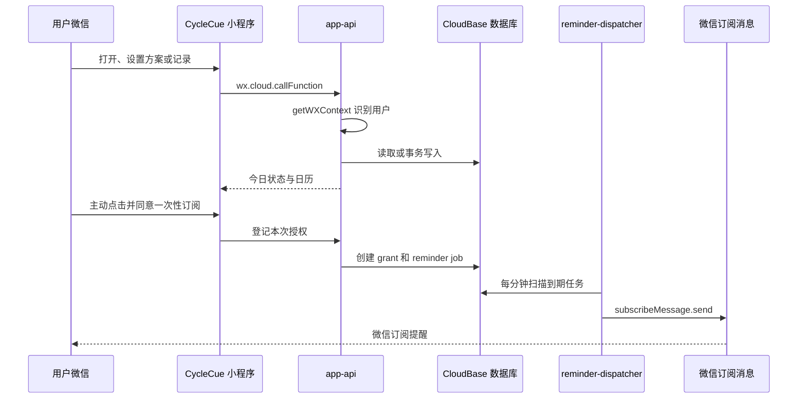

# CycleCue V1 开发、CloudBase 部署与微信发布执行手册

> 状态：执行基线
>
> 更新日期：2026-09-09
>
> 适用范围：CycleCue V1 开发环境、少量朋友体验和首个正式版本

本文是 CycleCue 的唯一发布执行手册。以后如果流程变化，先更新本文，再执行变更。

## 1. 工具分工

| 工具 | 唯一职责 | 不负责 |
|---|---|---|
| GitHub | 源码、Spec、执行手册、提交和版本标签 | 保存明文密钥、运行微信审核 |
| 微信开发者工具 | 模拟器、调试器、真机调试和人工预览 | 日常云函数部署、自动上传版本 |
| CloudBase CLI `tcb` | 云函数、函数配置和定时触发器部署 | 小程序前端上传、微信审核发布 |
| `miniprogram-ci` | 小程序前端编译、预览码和开发版本上传 | CloudBase 后端部署、审核发布 |
| 微信公众平台 | AppID、成员、类目、隐私、订阅模板、体验版、审核和发布 | 本地构建与云函数部署 |
| CloudBase 控制台 | 首次数据库、权限、秘密环境变量、OpenAPI 权限和日志 | 小程序审核发布 |

固定原则：同一类资源只有一个部署入口。云函数统一使用 `tcb`；即使 `miniprogram-ci` 也支持上传云函数，本项目也不使用该能力。

## 2. 当前基线

| 项目 | 当前值/状态 |
|---|---|
| GitHub | `JoyceJin0913/CycleCue`，`main` |
| 小程序 AppID | `wx849cb467eacf7e7a` |
| CloudBase 开发环境 | `cloud1-d4g9e75rt450f81b0` |
| CloudBase CLI | `3.8.1`，已安装，配置校验通过 |
| 微信项目根目录 | 仓库根目录，内含 `project.config.json` |
| 小程序源码 | `miniprogram/` |
| 云函数 | `app-api` 已部署并可用；`reminder-dispatcher` 按计划暂未部署 |
| 一次性订阅模板 | 尚未选择，客户端模板 ID 暂为空 |
| 当前模拟器状态 | 原 `FUNCTION_NOT_FOUND` 原因已解除，等待开发者工具重新编译/重试验证真实调用链 |

### 可以提交 Git 的标识符

- AppID；
- CloudBase 环境 ID；
- 微信订阅消息模板 ID；
- 函数名、集合名、索引定义和 cron。

### 绝对不能提交或发到聊天中的秘密

- AppSecret；
- 微信“代码上传密钥”私钥文件及其内容；
- 腾讯云 SecretId、SecretKey、临时 Token；
- CloudBase API Key；
- `USER_ID_HASH_SECRET`；
- 登录验证码、授权二维码和恢复码。

秘密只保存在本机安全目录、密码管理器或 CI Secret。

## 3. 部署流程与运行时调用链

### 3.1 部署流程


### 3.2 用户每天使用 App 时的调用链

CloudBase CLI 不参与日常运行，它只参与部署和运维。



## 4. 首次初始化流程

首次初始化只做一次。每一步达到“完成标志”后才能进入下一步。

### A. 账号与本地工程（已完成）

- [x] 取得 AppID；
- [x] 开发者工具导入仓库根目录；
- [x] 创建 CloudBase 开发环境；
- [x] 项目启用 TypeScript 编译；
- [x] 安装 CloudBase CLI 3.8.1；
- [x] `tcb validate` 通过。

### B. CloudBase CLI 登录

责任：你完成网页登录，Codex 启动并验证 CLI 会话。

```bash
tcb login --flow device
tcb env list --json
```

登录页面选择“使用微信公众平台账号登录”，再选择与 CycleCue AppID 对应的小程序。不需要 AppSecret，也不要向 Codex提供腾讯云永久密钥。

完成标志：`tcb env list --json` 能看到 `cloud1-d4g9e75rt450f81b0`。

### C. 建立文档型数据库

当前 `cloudbaserc.json` v2.1 的数据库编排只完整支持 PostgreSQL migration，不能可靠地声明式建立本项目的 NoSQL 集合、索引和安全规则。因此定义仍以仓库 `infra/database/` 为准。开发环境已由 Codex 通过 CloudBase CLI 的官方通用 API 完成首次建立和只读复查；控制台保留为人工回退入口。

创建 6 个集合：

```text
users
regimen_versions
dose_records
subscription_grants
reminder_jobs
idempotency_requests
```

每个集合的客户端权限都设置为不可读、不可写。小程序页面只调用 `app-api`，不直接访问数据库。

创建组合索引：

| 集合 | 索引名 | 索引字段 |
|---|---|---|
| `regimen_versions` | `owner_effective_from` | `ownerUserId ASC, effectiveFrom ASC` |
| `dose_records` | `owner_local_date` | `ownerUserId ASC, localDate ASC` |
| `subscription_grants` | `recipient_template_status_accepted` | `recipientUserId ASC, templateKey ASC, status ASC, acceptedAt ASC` |
| `reminder_jobs` | `status_scheduled_at` | `status ASC, scheduledAt ASC` |
| `reminder_jobs` | `recipient_status_scheduled_at` | `recipientUserId ASC, status ASC, scheduledAt ASC` |
| `idempotency_requests` | `user_expires_at` | `userId ASC, expiresAt ASC` |

`infra/database/security-rules.example.json` 是总览文档，不是可以一次导入所有集合的规则文件；需要逐个集合设置。

完成标志：6 个集合存在、6 个组合索引生效、普通客户端直接读写均被拒绝。

### D. 首次部署基础 API

先仅部署核心 `app-api`，不要提前启用尚未完成模板映射的提醒调度器。

```bash
npm run check
npm run cloud:validate
npm run cloud:deploy:api
tcb fn detail app-api --json
```

部署后，在 CloudBase 控制台或官方管理 API 中为 `app-api` 设置：

```text
USER_ID_HASH_SECRET=<至少 32 字节随机值>
MINIPROGRAM_STATE=developer
```

可以在本机执行 `openssl rand -hex 32` 生成 `USER_ID_HASH_SECRET`，但不要提交、截图或发到聊天中。

在函数权限控制中应用 `infra/functions/security-rules.json`：

- `app-api` 仅登录用户可从客户端调用；
- 其他函数默认禁止客户端调用；
- 定时触发器不受客户端函数调用规则影响。

当前云端配置已完成：函数为 `Active / Available`，运行时为 `Nodejs20.19`，入口为 `index.main`，两个环境变量均已配置且密钥值未落盘。完成标志仍以开发者工具重新编译后首次设置页可以打开并保存方案为准。

CloudBase Node 函数入口必须使用 `<文件名>.<导出函数名>`，例如 `index.main`。构建产物应位于函数根目录，不能配置成 `dist/index.main`。

不要用 `tcb fn invoke app-api` 代替小程序测试；直接调用通常没有微信 `OPENID/APPID` 上下文，不能证明真实调用链正常。

### E. 验证不含提醒的 Core V1

在开发者工具和真机逐项验证：

1. 首次设置 21+7 方案；
2. 今日页正确显示服药日或停药日；
3. 今日可记录“已服”和“未服”，并可修改；
4. 月历边界正确；
5. 数据库出现 `users`、`regimen_versions`、`dose_records` 记录；
6. 重复点击不会制造重复业务记录；
7. 客户端无法直接读取数据库。

这一步通过后，最基础且不含提醒的 V1 才算可运行。

### F. 选择一次性订阅消息模板

责任：你在微信公众平台选择模板，Codex 根据实际字段修改代码。

1. 进入微信公众平台的“订阅消息”；
2. 从当前小程序类目允许的公共模板库选择一次性订阅模板；
3. 选择能表达“记录提醒、提醒时间、提示内容”的字段；
4. 保存后把模板 ID 和字段名/类型截图提供给 Codex；
5. 不需要提供 AppSecret。

Codex 随后负责：

- 把模板 ID 写入客户端 `runtime.ts`；
- 给两个函数配置同一 `SELF_DUE_TEMPLATE_ID`；
- 把 dispatcher 中占位的 `thing1`、`time2`、`thing3` 改为实际字段；
- 补充测试并提交代码。

模板 ID不是秘密，因为客户端调用 `wx.requestSubscribeMessage` 时本来就需要它。

### G. 部署并验证提醒链路

先预览，再部署：

```bash
npm run cloud:validate
npm run cloud:plan
npm run cloud:deploy
tcb fn detail app-api --json
tcb fn detail reminder-dispatcher --json
```

在 CloudBase 控制台确认：

- `reminder-dispatcher` 已部署为普通 Event 函数，不是 HTTP 函数；
- 两个函数都有 `SELF_DUE_TEMPLATE_ID` 和 `MINIPROGRAM_STATE=developer`；
- `reminder-dispatcher` 获得 `subscribeMessage.send` OpenAPI 权限；
- `dispatch-every-minute` 触发器存在，cron 为 `0 * * * * * *`；
- 如果声明式部署没有创建触发器，再显式执行 `tcb fn trigger create`，不可假设已生效；
- 日志中没有循环报错。

真实验证顺序：先部署函数但暂不启用 trigger → 真机同意一次订阅 → 确认 `subscription_grants` 和 `reminder_jobs` 正确 → 启用 trigger → 设置数分钟后的提醒 → 验证收到一次消息 → 验证已记录后不再发送。

### H. 配置本机 `miniprogram-ci`

责任：你生成并安全保存上传密钥，Codex 创建和运行前端上传脚本。

1. 微信公众平台 → 开发管理 → 开发设置 → 小程序代码上传；
2. 生成并下载代码上传密钥；
3. 开启 IP 白名单，加入运行脚本机器的固定公网出口 IP；
4. 私钥放本机安全目录，并执行 `chmod 600 <私钥路径>`；
5. 通过 `WECHAT_UPLOAD_KEY_PATH` 传入路径，不复制进仓库。

本项目使用 `miniprogram-ci` 时，`projectPath` 必须是仓库根目录 `.`，不能写 `./miniprogram`。因为 `project.config.json` 位于根目录，并由其中的 `miniprogramRoot` 指向源码目录。

MVP 先在这台 Mac 上执行 `miniprogram-ci`。GitHub 托管 Runner 的公网出口 IP 会变化，不适合维护窄 IP 白名单；以后需要云端 CI 时，使用固定出口的自托管 Runner 或专用网络。

完成标志：脚本能生成预览二维码，并能上传开发版本到公众平台。

### I. 首个体验版与正式发布

1. `npm run check`；
2. 部署并验证开发环境后端；
3. 用 `miniprogram-ci` 上传明确版本号和描述；
4. 在公众平台“版本管理”中把该开发版本设为体验版；
5. 添加少量体验成员并完成真机回归；
6. 完成服务类目、隐私指引、备案和审核说明；
7. 提交审核；
8. 审核通过后由管理员人工点击发布；
9. 创建与上传版本一致的 Git tag。

“上传开发版本”“设为体验版”“提交审核”“正式发布”是四个不同动作，前一步不会自动完成后一步。

## 5. 日常流程

### 只做本地开发

```text
修改代码 → npm run check → 开发者工具编译 → 模拟器/真机调试
```

不需要登录 CloudBase CLI，也不需要上传微信版本。

### 更新开发环境后端

```bash
npm run check
npm run cloud:validate
npm run cloud:plan
npm run cloud:deploy
```

检查变更预览后再部署。不要默认使用 `--force`；强制覆盖可能同时覆盖函数配置和触发器。

### 给本人或朋友测试

```text
本地检查
→ 部署开发环境后端
→ 真机预览自测
→ miniprogram-ci 上传开发版本
→ 公众平台设为体验版
→ 体验成员回归
```

### 正式发布

```text
冻结版本
→ npm run check
→ 后端部署和日志验证
→ 前端上传
→ 体验版验收
→ 提交审核
→ 审核通过
→ 管理员发布
→ Git tag
```

版本使用 SemVer，例如 `0.1.0`。上传描述包含关键改动和 Git 短提交哈希，让微信后台版本可追溯到 GitHub。

## 6. 自动化边界

### Codex 可以自动完成

- 本地测试、类型检查和函数构建；
- CloudBase 配置校验、差异预览和部署；
- 云函数、触发器、详情和日志检查；
- 配置上传密钥后，用 `miniprogram-ci` 生成预览和上传开发版本；
- 提交、推送和版本标签。

### 必须由你确认或操作

- 微信/腾讯云扫码登录和授权；
- 付费套餐和资源扩容；
- 订阅消息模板选择；
- 下载、保管和轮换代码上传私钥；
- 类目、隐私、备案和审核资料；
- 真机体验验收；
- 提交审核和正式发布。

自动化不会绕过微信审核，也不会自动发布正式版本。

## 7. 故障定位

| 现象 | 所属层 | 首选处理 |
|---|---|---|
| `FUNCTION_NOT_FOUND` | CloudBase 后端 | 部署 `app-api`，再查函数详情 |
| 找不到页面对应 `.js` | 开发者工具编译 | 确认 TypeScript 编译插件后重新编译 |
| `SERVER_NOT_CONFIGURED` | 函数环境变量 | 设置 `USER_ID_HASH_SECRET` |
| `TEMPLATE_NOT_CONFIGURED` | 订阅模板 | 配置模板 ID和真实字段映射 |
| 数据库集合不存在 | CloudBase 数据库 | 按阶段 C 建立 6 个集合 |
| 查询提示缺少索引 | CloudBase 数据库 | 按表格建立组合索引 |
| `PERMISSION_DENIED` | 函数/数据库权限 | 核对调用规则、登录上下文和集合权限 |
| `tcb` 看不到目标环境 | CLI 账号不匹配 | 重新登录并选择该小程序的公众平台账号 |
| `miniprogram-ci` 鉴权失败 | 微信上传密钥 | 核对私钥、AppID、IP 白名单和密钥状态 |
| 上传成功但朋友打不开 | 微信版本管理 | 设为体验版并添加体验成员 |

## 8. 回滚原则

- 源码：创建新的 Git revert 提交，不改写公共 `main` 历史；
- 云函数：重新构建并部署已知正常的 Git tag；
- 小程序前端：使用公众平台提供的版本回退能力；
- 数据：V1 不自动执行破坏性 migration，改结构前先导出或备份；
- 提醒：若发送异常，先停用 dispatcher 定时触发器，再分析日志。

## 9. 从当前状态继续

- [x] 1. 完成 `tcb login --flow device` 的微信公众平台账号授权；
- [x] 2. 用 `tcb env list --json` 确认目标环境可见；
- [x] 3. 创建 6 个集合、6 个组合索引和客户端拒绝规则；
- [x] 4. 仅部署 `app-api`，配置 `USER_ID_HASH_SECRET`；
- [ ] 5. 验证首次设置、今日记录和月历；
- [ ] 6. 在公众平台选择一次性订阅模板；
- [ ] 7. 完成模板字段映射，部署 dispatcher；
- [ ] 8. 真机验证一次授权、一次发送及已记录后不发送；
- [ ] 9. 配置本机 `miniprogram-ci`；
- [ ] 10. 上传并设置第一个体验版；
- [ ] 11. 完成审核材料后提交首版。

## 10. 官方资料

- [CloudBase CLI 快速开始](https://docs.cloudbase.net/cli-v1/quick-start.html)
- [CloudBase CLI 部署云函数](https://docs.cloudbase.net/cli-v1/functions/deploy)
- [CloudBase 声明式部署](https://docs.cloudbase.net/cli-v1/declarative-deploy/deploy)
- [CloudBase 文档型数据库 CLI](https://docs.cloudbase.net/cli-v1/db/nosql/management)
- [CloudBase 云函数安全规则](https://docs.cloudbase.net/cloud-function/security-rules)
- [miniprogram-ci 包文档](https://www.npmjs.com/package/miniprogram-ci)
- [微信小程序协作与发布](https://developers.weixin.qq.com/miniprogram/dev/framework/quickstart/release.html)
- [微信小程序订阅消息](https://developers.weixin.qq.com/miniprogram/dev/framework/open-ability/subscribe-message.html)
- [wx.requestSubscribeMessage](https://developers.weixin.qq.com/miniprogram/dev/api/open-api/subscribe-message/wx.requestSubscribeMessage.html)
