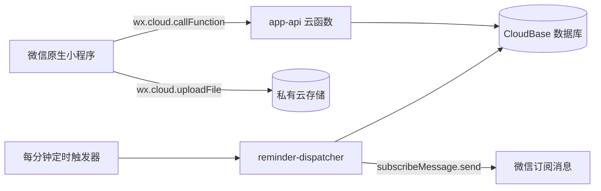

# 避孕药记录小程序 V1 MVP Spec

| 项目 | V1 决定 |
|---|---|
| 产品范围 | 首次设置、今日、日历、照片、朋友与朋友逾期提醒 |
| 支持方案 | 21 天服药 + 7 天停药；优思悦 24 片含药片 + 4 片安慰剂片 |
| 记录内容 | 已服 / 未服、服务端记录时间、可选本人照片 |
| 提醒方式 | 微信一次性订阅消息 |
| 登录 | 无显式登录页，使用小程序 `OPENID` |
| 技术栈 | 微信原生小程序 + TypeScript + CloudBase |
| 目标用户 | 自己及少量测试用户 |
| 文档状态 | Ready for V1 implementation |

## 1. V1 定义

V1 只验证一个最小闭环：

```text
首次设置 21+7 或优思悦 24+4 方案
  → 今日页告诉用户今天吃不吃
  → 到计划时间发送一次微信提醒
  → 用户确认已服或记录未服
  → 可拍照作为仅本人可见的记录附件
  → 保存服务端记录时间
  → 日历展示周期与历史结果
  → 确认已服时申请下一次微信提醒
  → 可邀请朋友只读查看今日状态
  → 经双方同意，逾期 30 分钟仍未完成记录时提醒朋友
```

V1 不解决“持续响铃”问题，也不尝试绕过微信的一次性订阅限制。微信提醒发送后，本次授权即可能被消耗；用户需要在下一次主动操作时继续授权。

## 2. V1 范围

### 2.1 必须实现

- 首次进入时设置方案开始日期和每日服药时间。
- 根据所选方案计算每天是含药片日、安慰剂片日或停药日。
- 今日页显示周期位置、计划时间和当天记录状态。
- 服药日可以“确认已服”或“记录未服”。
- “今日拍照片”作为醒目的主操作，同时保留无照片确认已服。
- 照片保存在私有云存储，监督朋友不可查看照片或 fileID。
- 保存服务端记录时间，不把手机本地时间作为事实时间。
- 日历展示含药片日、安慰剂片日、停药日、已服、未服和逾期未记录。
- 首次保存方案时申请一次微信订阅消息。
- 每次确认已服后，再申请并登记下一次微信提醒。
- 微信提醒授权失败时，方案和服药记录仍然正常保存。
- 用户可以从今日页重新进入方案设置，修改日期或时间。
- 用户可以生成 48 小时、单次领取的邀请，最多建立 3 个朋友关系。
- 朋友无需建立自己的方案，也能查看受邀用户的今日状态与最后记录时间。
- 服药者可逐位允许朋友提醒；朋友本人可用一次性订阅开启下一次逾期提醒。
- 计划时间后 30 分钟仍无记录或明确记录为未服时提醒朋友；已服则不发送，并把未消费授权顺延到下一个计划日。
- 双方均可关闭提醒或结束朋友关系，停止后不得继续发送。

### 2.2 明确不实现

- 不单独保存或展示所谓“照片拍摄时间”，只保存服务端记录时间。
- 不向朋友展示照片、历史月历或药物详情。
- 不接入手机系统日历。
- 不发送短信、电话、公众号或企业微信消息。
- 不支持多个药物或多个并行方案。
- 不获取微信昵称、头像或手机号。
- 不提供漏服后的医学建议。
- 不支持任意自定义周期；V1 只提供 21+7 和优思悦 24+4 两个预设。
- 不做独立后台、运营系统或复杂埋点。

## 3. 产品原则

### 3.1 今天的状态必须最清楚

用户打开小程序后，首屏首先回答：

1. 今天要不要服药；
2. 今天有没有记录；
3. 如果记录了，是什么时间记录的；
4. 下一次微信提醒有没有覆盖。

### 3.2 记录优先于提醒授权

订阅授权是附加能力，不能成为记录成功的前置条件：

```text
记录成功 + 提醒授权成功 = 正常完成
记录成功 + 提醒授权失败 = 记录仍然完成，提示下次提醒未开启
记录失败 + 提醒授权成功 = 提示记录失败，但保留这次提醒授权
```

### 3.3 不做医疗判断

“晚于计划时间记录”和“明确未服”只是事实描述。程序不得显示“避孕已经失效”“需要补服几片”等结论。统一提示：

> 如果发生漏服或不确定情况，请查看对应药品说明书或咨询医生。

## 4. 页面结构

V1 有三个 Tab、一个设置流程和一个邀请领取页：

```text
首次设置（非 Tab）

今日 Tab        日历 Tab        朋友 Tab
                              邀请领取页（分享进入）
```

方案修改复用“首次设置”页面的编辑模式，不新增独立设置 Tab。

### 4.1 首次设置页

```text
┌────────────────────────────┐
│ 设置服药计划                  │
│                            │
│ 方案                         │
│ [ 21+7 ]  [ 优思悦 24+4 ]      │
│                            │
│ 当前药板第一天                 │
│ [ 2026-09-09          > ]    │
│                            │
│ 每日提醒时间                   │
│ [ 22:30               > ]    │
│                            │
│ 从今天开始，连续 21 天每天       │
│ 22:30 记录，之后停 7 天。        │
│                            │
│ ┌────────────────────────┐ │
│ │   保存并开启下一次微信提醒    │ │
│ └────────────────────────┘ │
│ 稍后也可以修改                  │
└────────────────────────────┘
```

字段：

| 字段 | 类型 | 默认值 | 规则 |
|---|---|---|---|
| 方案 | 单选预设 | 21+7 | 可选择 21+7 或优思悦 24+4 |
| 当前药板第一天 | 日期 | 今天 | 可选择今天或过去日期 |
| 每日服药时间 | 时间 | 22:30 | `HH:mm`，必填 |

提交按钮必须由用户点击，因此可以在点击处理函数中调用 `wx.requestSubscribeMessage`。该接口从基础库 2.8.2 起要求用户点击或支付回调后才能调起。[^1]

### 4.2 今日页

服药日、尚未记录：

```text
┌────────────────────────────┐
│ 9 月 9 日              计划设置 │
│ 本周期第 8 / 28 天             │
│                            │
│        今天需要服药             │
│        计划时间 22:30           │
│                            │
│ ┌────────────────────────┐ │
│ │        确认已服             │ │
│ └────────────────────────┘ │
│          记录今天未服           │
│                            │
│ 微信提醒：今天 22:30 已覆盖       │
└────────────────────────────┘
```

已记录：

```text
┌────────────────────────────┐
│        ✓ 今天已记录             │
│        记录于 22:37             │
│                            │
│ 下一次微信提醒                  │
│ 9 月 10 日 22:30 · 已开启        │
│                            │
│          修改今天的记录          │
└────────────────────────────┘
```

停药日：

```text
┌────────────────────────────┐
│        今天是停药日             │
│        今天无需服药              │
│                            │
│ 下次服药：9 月 30 日 22:30        │
│                            │
│          查看完整日历            │
└────────────────────────────┘
```

优思悦第 25–28 片不是停药日：今日页显示“今天服用白色安慰剂片”，并允许与含药片相同的记录和拍照操作；服完第 28 片后，下一天进入新药板第 1 片。

今日页右上角“计划设置”进入设置页编辑模式。

### 4.3 日历页

```text
┌────────────────────────────┐
│ ‹       2026 年 9 月       ›    │
│ 一  二  三  四  五  六  日        │
│     1  2  3  4  5  6            │
│ 7  8  ●  ✓  !  —  ○            │
│ ...                            │
│                            │
│ ● 待服  ✓ 已服  — 未服           │
│ ! 逾期未记录  ○ 停药日            │
│                            │
│ 9 月 9 日                      │
│ 应服药 · 22:30 · 尚未记录         │
└────────────────────────────┘
```

日历只读。点击日期显示当天详情，不在 V1 中补记过去日期。

## 5. 页面状态

### 5.1 计划状态

| 状态 | 含义 |
|---|---|
| `before_start` | 方案还没有开始 |
| `active` | 当天需要服用含药片 |
| `placebo` | 当天需要按药板顺序服用安慰剂片 |
| `break` | 当天是停药日 |

### 5.2 用户记录状态

| 状态 | 含义 |
|---|---|
| `none` | 用户尚未记录 |
| `taken` | 用户确认已服 |
| `not_taken` | 用户明确记录未服 |

### 5.3 页面派生状态

| 条件 | 页面状态 |
|---|---|
| 日期早于方案第一天 | `before_start` |
| 处于 7 天停药段 | `break` |
| 优思悦周期第 25–28 天 | 与 active 相同地派生 `taken`、`not_taken`、`future` 或 `unrecorded_overdue` |
| 记录为 taken | `taken` |
| 记录为 not_taken | `not_taken` |
| 尚未到计划时间且无记录 | `future` |
| 已到计划时间且无记录 | `unrecorded_overdue` |

V1 不引入宽限期，也不区分医学意义上的“迟服”。如果在计划时间后确认，只显示“晚于计划时间记录”。

## 6. 核心流程

### 6.1 首次建立方案

1. 小程序启动并调用 `bootstrap.get`。
2. 云函数从 `cloud.getWXContext()` 获取当前 `OPENID`，静默创建或读取用户；客户端不提供可信用户 ID。[^2]
3. 没有方案则进入首次设置。
4. 用户选择药板第一天和每日时间。
5. 用户点击“保存并开启下一次微信提醒”。
6. 点击处理函数立即调用 `wx.requestSubscribeMessage`，只传入一个本人提醒模板 ID。
7. 无论订阅结果如何，都调用 `regimen.save`。
8. 模板结果为 `accept` 时，独立调用 `subscription.register`。
9. 进入今日页。

新 grant 只允许覆盖 `scheduledAt > serverNow` 的 occurrence。若今天的计划时间已经过去，即使今天仍未记录，也必须从下一个服药日开始安排，禁止收到一条刚开启便立即发送的过时提醒。

### 6.2 确认已服

1. 用户点击“确认已服”。
2. 弹出确认框：“确认今天已经服用？将记录当前服务器时间。”
3. 用户点击“确认并续订下一次提醒”。
4. 立即调用 `wx.requestSubscribeMessage`。
5. 调用 `dose.setToday({ status: 'taken' })`。
6. 若模板结果为 `accept`，调用 `subscription.register`。
7. 今日页刷新：首次记录显示服务端 `firstRecordedAt`；发生修正后显示 `lastChangedAt`。

重复点击或网络重试只能更新同一个今日 occurrence，不能创建第二条记录。

### 6.3 记录未服

1. 用户点击“记录今天未服”。
2. 二次确认：“这里只记录事实，不会给出医学建议。”
3. 调用 `dose.setToday({ status: 'not_taken' })`。
4. 今日页显示“今天记录为未服”。
5. 展示查看药品说明书或咨询医生的提示。

此操作不主动申请下一次提醒；用户可以点击页面中的“开启下一次提醒”。

### 6.4 修改今天的记录

- 只允许修改当前方案时区中的今天。
- `taken` 与 `not_taken` 可以互相修正。
- 修改前必须二次确认。
- 保留最后修改时间，但 V1 不建设完整审计历史页。
- 修改不会撤回已经发送的微信提醒。

### 6.5 修改方案

1. 从今日页点击“计划设置”。
2. 复用首次设置页，展示当前开始日期和每日时间。
3. 保存时创建新方案版本，不覆盖旧版本。
4. 保存后从今天立即生效；今天已有的事实记录和照片继续保留。
5. 取消旧版本从今天起尚未发送的提醒任务，并移除尚未生效的旧修改。
6. 如果用户在保存点击中同意订阅，为新版本安排下一次提醒。

版本区间采用左闭右开 `[effectiveFrom, effectiveTo)`：首次版本 `effectiveFrom = startDate`；之后修改的版本 `effectiveFrom = today`，旧版本的 `effectiveTo` 等于今天。只修改提醒时间时保留用户选择的药板第一天；修改药板第一天时要求 `startDate <= today`。同一天重复修改直接更新当天版本，避免产生重叠区间。月历按每个日格分别选择覆盖该日期的版本，不能只读取当前 active version。

## 7. 周期算法

V1 使用两个固定预设：

```ts
standard_21_7 = { activeDays: 21, placeboDays: 0, breakDays: 7 }
yaz_24_4 = { activeDays: 24, placeboDays: 4, breakDays: 0 }
```

算法：

```ts
function getPlanDay(startDate: LocalDate, targetDate: LocalDate, cycle: RegimenCycle) {
  const offset = civilDayOrdinal(targetDate) - civilDayOrdinal(startDate)

  if (offset < 0) {
    return { status: 'before_start' }
  }

  const cycleLength = cycle.activeDays + cycle.placeboDays + cycle.breakDays
  const dayIndex = ((offset % cycleLength) + cycleLength) % cycleLength

  return {
    status: dayIndex < cycle.activeDays
      ? 'active'
      : dayIndex < cycle.activeDays + cycle.placeboDays
        ? 'placebo'
        : 'break',
    cycleDay: dayIndex + 1,
  }
}
```

`civilDayOrdinal` 必须严格解析并验证真实公历日期，禁止依赖宿主进程本地时区：

```ts
function civilDayOrdinal(value: string): number {
  const match = /^(\d{4})-(\d{2})-(\d{2})$/.exec(value)
  if (!match) throw new Error('INVALID_LOCAL_DATE')

  const year = Number(match[1])
  const month = Number(match[2])
  const day = Number(match[3])
  const utcMs = Date.UTC(year, month - 1, day)
  const check = new Date(utcMs)

  if (
    check.getUTCFullYear() !== year ||
    check.getUTCMonth() !== month - 1 ||
    check.getUTCDate() !== day
  ) {
    throw new Error('INVALID_LOCAL_DATE')
  }

  return Math.floor(utcMs / 86_400_000)
}
```

实现规则：

- `startDate` 和 `targetDate` 使用 `YYYY-MM-DD` 日历日期；
- V1 方案时区固定为 `Asia/Shanghai`；
- 禁止 `new Date('YYYY-MM-DD')` 和两个本地 `Date` 的毫秒差；只有严格验证后的 UTC civil-day ordinal 可以除以 `86400000`；
- 服务端负责最终判断今天的 local date 和 occurrence；
- `firstRecordedAt` 和 `lastChangedAt` 均使用服务端时间；
- 页面从后台恢复时通过 `onShow` 刷新，避免跨午夜仍显示昨天。微信 Tab 页面会被保留，重新显示时触发 `onShow`，不能只依赖首次 `onLoad`。[^3]

21+7 边界测试：

| offset | 预期 |
|---:|---|
| -1 | before_start |
| 0 | active，第 1 天 |
| 20 | active，第 21 天 |
| 21 | break，第 22 天 |
| 27 | break，第 28 天 |
| 28 | active，新周期第 1 天 |

还必须覆盖跨月、跨年和闰年。

优思悦还必须覆盖第 24 片为 `active`，第 25、28 片为 `placebo`，第 29 天回到新药板第 1 片。`active` 与 `placebo` 都属于需要记录和提醒的服用日。

## 8. 微信一次性提醒

### 8.1 V1 提醒规则

- 只配置一个本人提醒模板 `SELF_DUE`。
- 每份 `accept` 结果登记为一次可发送机会。
- 首次设置时获得的授权覆盖最早一个尚未到点的服药日。
- 每次确认已服后获得的新授权覆盖下一个服药日。
- 所有新 grant 只能绑定 `scheduledAt > serverNow` 的未来 occurrence，绝不补发已经过点的今天。
- 21+7 的停药期自动跳到下一周期第一天；优思悦的 4 片安慰剂片仍逐日安排提醒。
- 到达计划时间时只发送一次，不做 10 分钟、30 分钟重复发送。
- 用户未记录且没有再次打开小程序时，系统不能自动获得下一份授权。
- 提醒发送失败不改变服药记录。

当前官方接口允许一次调用最多传入 5 个模板 ID，但 V1 只传一个。回调必须读取该模板 ID 对应的 `accept/reject/ban/filter`，不能只判断整个接口调用成功。一次性模板和长期模板不能混用。[^1]

### 8.2 用户可见的提醒状态

| 状态 | 文案 |
|---|---|
| 已安排今天 | 今天 22:30 的微信提醒已开启 |
| 已安排未来 | 下一次微信提醒：9 月 10 日 22:30 |
| 没有授权 | 下一次微信提醒未开启 |
| 被拒绝 | 你没有开启下一次微信提醒 |
| 微信主开关关闭 | 请在小程序设置中开启订阅消息 |
| 发送额度失效 | 本次提醒未能发送，请重新开启下一次提醒 |

页面不得显示“保证提醒”“持续提醒”或“闹钟已开启”。

### 8.3 授权与记录的协调

`wx.requestSubscribeMessage` 必须在用户点击中立即发起。用户选择后：

```text
核心写入 regimen/dose ───────────┐
                                 ├─ 独立返回各自结果
授权登记 subscription.register ──┘
```

两者不做分布式事务。客户端对授权结果为 `accept` 的请求使用本地小型待同步队列，保存：

```ts
{
  requestId: string
  templateKey: 'SELF_DUE' | 'CAREGIVER_OVERDUE'
  source: 'onboarding' | 'dose_confirm' | 'manual_enable' | 'care_manual'
  relationshipId?: string
}
```

服务端确认登记后删除本地项；下次 `onShow` 可重试。`subscription.register` 必须按 requestId 幂等并限频。客户端只提交 requestId、语义化 templateKey 和 source；真实模板 ID 从服务端配置读取，`acceptedAt` 由服务器生成，不接受客户端提供的模板 ID、时间或 recipient。每个用户每天最多登记 10 次，同一模板最多保留 2 个未消费 grant。

### 8.4 服务端发送

订阅消息只能由服务端下发。CloudBase 云函数可调用 `cloud.openapi.subscribeMessage.send`。[^4]

使用一个每分钟触发的 `reminder-dispatcher`：

```text
读取已到期 pending job
  → 原子持久化为 dispatching，并写 dispatchStartedAt
  → 再次确认今天仍是服药日且仍未记录
  → 调用微信发送接口
  → 标记 sent / skipped / failed / unknown
```

CloudBase 定时触发器使用七段 cron，并可能在边缘情况下重复触发，所以任务必须幂等。[^5]

### 8.5 朋友逾期提醒

朋友提醒使用独立模板 `CAREGIVER_OVERDUE`，授权归接收消息的朋友本人所有，并绑定一段有效 `care_links` 关系。服药者和朋友双方都同意后，系统把检查时间设为计划服药时间加 30 分钟：

```text
已服                → 不发送，未消费授权顺延到下一个计划日
明确记录为未服       → 发送“对方已记录为未服，请联系确认”
仍无记录             → 发送“对方尚未完成记录，请联系确认”
```

发送前必须再次验证关系仍为 active、服药者仍允许提醒、grant 仍保留给当前 job。消息不包含药名、方案类型、照片或历史记录。一次实际发送后授权被消费，朋友需要再次主动开启下一次提醒。

```json
{
  "triggers": [
    {
      "name": "dispatch-every-minute",
      "type": "timer",
      "config": "0 * * * * * *"
    }
  ]
}
```

任务唯一键：

```text
SHA-256(recipientUserId + templateId + occurrenceId + "self_due")
```

发送前如果已经记录，则任务变为 `skipped_already_recorded`。释放和重新保留 grant 必须在同一事务完成：`reserved → available → reserved`，保证一份 grant 同时最多绑定一个 active job。

V1 明确选择 **at-most-once** 交付：外部发送开始前先持久化 `dispatching`。如果函数在调用微信前崩溃，可能漏发；如果在调用后、结果落库前崩溃，租约到期只能转为 `unknown`，不得自动重发。这样无法做到严格 exactly-once，但可以避免在结果不确定时主动制造重复消息。验收中的“不重复发送”仅承诺正常返回、并发抢占和定时器重复触发场景，不承诺跨外部调用崩溃的数学意义 exactly-once。

### 8.5 发送错误处理

| 微信结果 | V1 处理 |
|---|---|
| 成功 | job=`sent`，grant=`consumed` |
| `43101` 未订阅/额度耗尽 | job=`terminal_failed`，grant=`invalid` |
| `43107` 模板或能力被封 | 停止发送并告警 |
| `43108` 同一用户并发发送 | 对同一用户串行化后短延迟重试 |
| `45168` 敏感词 | 停止发送并修正模板数据 |
| `47003` 模板参数错误 | 停止发送并修正字段映射 |
| 网络超时、结果未知 | job=`unknown`，grant=`invalid`，不自动重发 |

相关错误码由微信订阅消息发送接口定义。[^4]

## 9. 技术架构



### 9.1 客户端目录

```text
miniprogram/
  app.ts
  app.json
  app.wxss
  pages/
    launch/
    onboarding/
    today/
    calendar/
    care/
    invite/
  components/
    today-status-card/
    reminder-status/
    calendar-grid/
  domain/
    regimen.ts
    local-date.ts
    day-status.ts
  services/
    cloud-api.ts
    subscription.ts
    local-cache.ts
  config/
    env.ts
    templates.ts
```

页面 `data` 只保存渲染需要的 view model。避免频繁传输大对象，并合并 `setData`；微信官方性能文档指出，`setData` 的数据量和页面 Shadow Tree 大小都会影响性能。[^6]

### 9.2 云函数目录

```text
cloudfunctions/
  app-api/
    actions/
      bootstrap.ts
      regimen.ts
      dose.ts
      subscription.ts
  reminder-dispatcher/
packages/
  domain/
```

- `app-api` 是唯一允许小程序客户端调用的业务函数。
- `reminder-dispatcher` 只接受定时触发，不允许客户端调用。
- 所有业务数据库集合设为仅管理端可读写。
- `app-api` 显式使用当前环境的管理端数据库客户端；同时从 `getWXContext()` 获取业务身份，并在函数内做资源归属校验。
- 周期算法放在纯 TypeScript domain 包，由客户端和云函数共同使用。

建议云函数规则：

```json
{
  "*": { "invoke": false },
  "app-api": { "invoke": "auth != null" }
}
```

CloudBase 的函数安全规则只约束客户端调用，不影响定时触发器。[^7]

## 10. API

统一请求：

```ts
type ApiRequest<T> = {
  action: string
  requestId: string
  payload: T
}
```

统一响应：

```ts
type ApiResponse<T> =
  | { ok: true; requestId: string; serverNow: string; data: T }
  | {
      ok: false
      requestId: string
      serverNow: string
      error: {
        code: string
        message: string
        retryable: boolean
      }
    }
```

V1 actions：

| Action | 输入摘要 | 输出摘要 |
|---|---|---|
| `bootstrap.get` | 无 | 用户初始化状态、当前方案、今日状态、提醒覆盖 |
| `regimen.save` | startDate、scheduledLocalTime | 新方案版本、今日状态 |
| `dose.setToday` | `taken` 或 `not_taken` | occurrence、firstRecordedAt、lastChangedAt |
| `photo.prepareUpload` | 文件扩展名、大小 | 一小时有效的 owner-only 上传票据 |
| `dose.getMonth` | `YYYY-MM` | 42 个日格状态 |
| `subscription.register` | templateKey、source、accept requestId；朋友提醒另带 relationshipId | 本人或指定朋友关系的下一次提醒覆盖 |
| `subscription.getStatus` | 无 | 下一次提醒覆盖状态 |
| `care.invite.create` | 本人自定义称呼 | 48 小时邀请 token |
| `care.invite.preview` | token | 脱敏邀请摘要 |
| `care.invite.claim` | token、朋友称呼 | 单次领取并建立关系 |
| `care.list` | 无 | 与当前用户有关的关系及裁剪后的今日状态 |
| `care.overduePermission.set` | relationshipId、enabled | 服药者允许或关闭该朋友的逾期提醒 |
| `care.reminder.disable` | relationshipId | 朋友撤销尚未使用的下一次提醒 |
| `care.link.remove` | relationshipId | 任一方结束关注关系并取消未发送提醒 |

服务端不接受客户端提供的 `openId`、`ownerId` 或任意 occurrenceId 作为可信身份。今日 occurrence 由服务端按当前方案和日期计算；朋友跨用户读取必须先验证有效 `care_links`，响应永不返回照片字段。

## 11. 数据模型

### 11.1 `users`

```ts
type UserDoc = {
  _id: string
  openid: string
  appid: string
  timezone: 'Asia/Shanghai'
  activeRegimenVersionId?: string
  createdAt: ServerDate
  updatedAt: ServerDate
}
```

`_id` 使用服务端 HMAC 从 `APPID + OPENID` 派生；原始 `openid` 只在管理端集合中保存，用于发送消息。

### 11.2 `regimen_versions`

```ts
type RegimenVersionDoc = {
  _id: string
  ownerUserId: string
  startDate: string
  regimenKind: 'standard_21_7' | 'yaz_24_4'
  activeDays: 21 | 24
  placeboDays: 0 | 4
  breakDays: 7 | 0
  scheduledLocalTime: string
  timezone: 'Asia/Shanghai'
  effectiveFrom: string
  effectiveTo?: string
  status: 'active' | 'superseded'
  createdAt: ServerDate
}
```

索引：`ownerUserId + effectiveFrom(desc)`。

### 11.3 `dose_records`

```ts
type DoseRecordDoc = {
  _id: string // hash(regimenVersionId + localDate)
  ownerUserId: string
  regimenVersionId: string
  localDate: string
  plannedAt: ServerDate
  status: 'taken' | 'not_taken'
  firstRecordedAt: ServerDate
  lastChangedAt: ServerDate
  revisions: Array<{
    fromStatus: 'taken' | 'not_taken'
    toStatus: 'taken' | 'not_taken'
    changedAt: ServerDate
  }> // 最多保留 10 条
  updatedAt: ServerDate
  firstRequestId: string
  lastRequestId: string
}
```

索引：`ownerUserId + localDate(desc)`。

### 11.4 `subscription_grants`

```ts
type SubscriptionGrantDoc = {
  _id: string
  recipientUserId: string
  subjectUserId?: string
  careLinkId?: string
  templateKey: 'SELF_DUE' | 'CAREGIVER_OVERDUE'
  templateId: string
  status: 'available' | 'reserved' | 'consumed' | 'invalid' | 'cancelled_by_friend' | 'cancelled_by_owner' | 'relationship_ended'
  source: 'onboarding' | 'dose_confirm' | 'manual_enable' | 'care_manual'
  requestId: string
  reservedJobId?: string
  acceptedAt: ServerDate
  consumedAt?: ServerDate
  invalidReason?: string
}
```

索引：`recipientUserId + status + acceptedAt`。`requestId` 必须防止一次 accept 被登记两次。

### 11.5 `reminder_jobs`

```ts
type ReminderJobDoc = {
  _id: string
  recipientUserId: string
  subjectUserId?: string
  careLinkId?: string
  regimenVersionId: string
  occurrenceId: string
  localDate: string
  scheduledAt: ServerDate
  templateKey: 'SELF_DUE' | 'CAREGIVER_OVERDUE'
  grantId: string
  status:
    | 'pending'
    | 'dispatching'
    | 'sent'
    | 'unknown'
    | 'terminal_failed'
    | 'skipped_already_recorded'
    | 'skipped_plan_changed'
  dispatchStartedAt?: ServerDate
  leaseUntil?: ServerDate
  dispatchToken?: string
  attemptCount: number
  lastErrorCode?: string
  sentAt?: ServerDate
  createdAt: ServerDate
  updatedAt: ServerDate
}
```

索引：`status + scheduledAt(asc)`。

### 11.6 `idempotency_requests`

```ts
type IdempotencyRequestDoc = {
  _id: string
  userId: string
  action: string
  requestId: string
  payloadHash: string
  status: 'processing' | 'completed' | 'failed_retryable'
  resultCode?: string
  resultRef?: string
  createdAt: ServerDate
  expiresAt: ServerDate
}
```

同一用户、action、requestId 但 payload 不同，返回 `IDEMPOTENCY_CONFLICT`。

幂等执行规则：首次请求在业务事务内创建 `processing`；并发请求看到有效 processing 时返回 `REQUEST_IN_PROGRESS`；completed 直接返回同一 resultRef。processing 超时后不能盲目重做，而要先按 action 检查确定性业务实体是否已经创建：存在则补写 completed，不存在才接管执行。

## 12. 事务与并发

CloudBase 数据库事务只支持服务端 Node SDK，适合在一个事务内更新多份关联数据。[^8]

V1 必须使用事务的操作：

- `regimen.save`：创建新版本、替换 active version、取消旧提醒；
- `dose.setToday`：claim 幂等请求、upsert 今日记录、取消今天尚未发送的任务；
- `subscription.register`：创建 grant、保留下一个 occurrence、创建 reminder job；
- dispatcher：把 job 和 grant 原子转为 dispatching。

微信发送接口不得放进数据库事务。流程必须是：

```text
事务抢占任务
  → 调用微信接口
  → 条件更新发送结果
```

## 13. 缓存与离线

- 缓存最近一次 bootstrap、当前方案和最近两个月月历摘要。
- 页面可以先展示缓存，再通过 `onShow` 刷新。
- 离线时显示“当前为上次同步结果”。
- 离线状态不允许把“确认已服”显示为成功。
- V1 不做离线写入队列；用户必须看到服务端成功结果。
- 订阅 accept 的待同步项可以使用独立的小型本地队列，因为它不代表服药记录。

## 14. 错误处理

| 错误码 | 用户文案 | 处理 |
|---|---|---|
| `NETWORK_UNAVAILABLE` | 网络不可用，暂时无法同步 | 保持当前页，可重试 |
| `PLAN_NOT_FOUND` | 请先设置服药计划 | 进入设置 |
| `NOT_ACTIVE_DAY` | 今天是停药日，无需记录 | 刷新今日状态 |
| `INVALID_DATE` | 请选择有效的药板开始日期 | 留在设置页 |
| `INVALID_TIME` | 请选择有效时间 | 留在设置页 |
| `SUBSCRIPTION_REJECTED` | 记录已保存，但下一次提醒未开启 | 不回滚记录 |
| `SUBSCRIPTION_SYNC_FAILED` | 记录已保存，提醒同步失败 | 保留授权待同步项 |
| `IDEMPOTENCY_CONFLICT` | 请求信息发生变化，请刷新后重试 | 刷新页面 |
| `REQUEST_IN_PROGRESS` | 正在处理，请稍候 | 轮询 bootstrap |

错误页面只展示短 requestId，不展示 OPENID、数据库错误栈或模板 ID。

### 11.7 `photo_uploads`、`care_invites` 与 `care_links`

- `photo_uploads` 保存一小时有效、只能绑定一次的上传票据；图片本体位于私有云存储。
- `care_invites` 只保存邀请 token 的 SHA-256 摘要，状态为 `pending/claimed`，48 小时过期。
- `care_links` 保存 owner 与 caregiver 的内部匿名 ID、双方自定义称呼和权限；V1 固定 `canViewEvidence=false`、`canViewHistoryDays=0`。
- `care_links.ownerAllowsOverdue` 默认 false；朋友的下一次提醒覆盖由 grant/job 派生，不把一次性微信授权误表示为长期订阅。
- 邀请不能由本人领取，只能成功领取一次；同一 owner 最多 3 个 active 关系。

## 15. 隐私与安全最低线

V1 使用用户主动选择的照片，但不获取微信昵称、头像、手机号、位置或系统日历权限。发布前必须在微信隐私保护指引中声明照片用途。

仍然必须做到：

- 使用平台透传 OPENID，不信任客户端身份字段；
- 业务集合仅管理端可读写；
- 云函数逐 action 校验用户资源归属；
- 模板消息使用通用标题“每日记录提醒”，不在锁屏直接写“避孕药”；
- 日志不记录原始 OPENID、用户计划详情或完整消息文案；
- 照片存储路径使用内部匿名用户 ID，私有存储不生成永久公开链接；
- 朋友接口仅返回今日状态与记录时间，不返回照片 fileID；
- 朋友提醒模板不出现药名、方案类型或照片信息；
- 数据库只保存邀请 token 摘要，不保存分享出去的原始 token；
- 模板字段严格做长度和字符白名单；
- `subscription.register` 按用户每天限频；
- 设置页复用页面提供“清除我的数据”入口可以延期到 V1.1，但正式扩大测试前必须补齐。

## 16. 测试与验收

### 16.1 周期测试

- 21+7：第 1、21 天显示服药，第 22、28 天显示停药，第 29 天回到新周期第 1 天。
- 优思悦：第 1、24 天显示浅粉色含药片，第 25、28 天显示白色安慰剂片，第 29 天回到新药板第 1 片。
- 方案开始前显示未开始。
- 正确处理月末、年末和闰年。
- 页面跨午夜后刷新为新日期。

### 16.2 记录测试

- 确认已服后显示服务端记录时间。
- 记录未服后不被显示为“未知是否服用”。
- 同一个 requestId 重试 10 次只有一条记录。
- 并发点击只能得到一个今日 occurrence。
- 今天是 21+7 停药日时服务端拒绝写入；优思悦安慰剂片日允许写入和拍照。
- 修改记录更新同一 occurrence，不新增第二条。

### 16.3 订阅提醒测试

- 首次设置同意订阅后创建一条 grant 和一条 job。
- 拒绝订阅时方案仍保存。
- 确认已服同意订阅后覆盖下一个服药日。
- 第 21 天确认后，下一次提醒跳过 7 天停药期。
- 优思悦第 24、25、28 片确认后，提醒依次覆盖下一片，不跳过安慰剂片。
- dispatcher 并发或重复触发时，同一任务只有一个执行者进入外部发送阶段。
- 到点前已经记录时跳过消息，grant 重新分配。
- 正确处理 `43101/43107/43108/45168/47003`。
- 网络超时进入 unknown，不自动二次发送。

### 16.4 照片与朋友测试

- 拍照上传成功后，同一个今日 occurrence 显示有照片，照片只对本人可见。
- 过期、他人或已绑定的上传票据不能绑定记录。
- 邀请不能自己领取，过期或已领取 token 不能再次领取，第 4 位朋友加入失败。
- 没有自己方案的朋友从普通入口打开时进入“朋友”页。
- 朋友能看到今日状态与最后记录时间，但任何响应都不包含照片 fileID。
- 未经服药者允许时，朋友不能登记提醒授权。
- 服药者按时记录后，T+30 不发送朋友消息并顺延授权。
- T+30 明确未服和未记录分别产生准确但不做医学判断的文案。
- 关闭提醒或结束关系后，dispatcher 发送前复查必须阻止消息。

### 16.5 真机测试

至少使用一台 iPhone 和一台 Android：

- 首次订阅同意、拒绝和关闭消息总开关；
- 勾选“总是保持以上选择”后的再次请求；
- 从微信设置修改订阅选择；
- 正式模板消息的时间、文本和页面跳转；
- 小程序切后台、跨午夜和重新打开；
- 弱网下重复点击和云函数超时。

### 16.6 V1 完成定义

V1 同时满足以下条件才算完成：

1. 新用户可在 60 秒内建立方案并进入今日页。
2. 连续模拟 35 天，21+7 与优思悦 24+4 状态全部正确。
3. 每天只能有一条事实记录。
4. 微信授权拒绝不会造成方案或记录丢失。
5. 具备有效授权时，定时任务能在目标分钟附近调用微信发送接口。
6. 两个不同微信账号完成一次邀请与领取，朋友端无法读取照片。
7. 照片上传、绑定和本人预览在真机完成一次闭环。
8. 没有系统日历、多药物或医疗建议入口。
9. iOS 和 Android 各完成一次完整真机闭环。

## 17. 开发顺序

### V1.0-A：页面与周期

- 初始化原生 TypeScript 小程序。
- 完成首次设置、今日、日历三个页面。
- 完成 21+7、优思悦 24+4 纯日期算法及单元测试。
- 使用本地 mock 数据跑通交互。

### V1.0-B：云端记录

- 创建 `app-api`、数据库集合和索引。
- 完成静默身份、方案版本和今日记录。
- 完成幂等、服务端时间和月历查询。

### V1.0-C：微信提醒

- 在小程序后台确定一个可用的一次性模板。
- 完成请求订阅、授权账本、提醒任务和 dispatcher。
- 完成发送错误分类和真机验证。

### V1.0-D：照片与朋友

- 完成私有照片上传票据、绑定和本人预览。
- 完成一次性邀请、最多 3 人限制与朋友只读今日状态。
- 使用两个不同微信账号验证照片不可见。

### V1.1：朋友逾期提醒

- 增加服药者逐位授权、朋友一次性订阅、关闭提醒与结束关系。
- 增加计划时间后 30 分钟检查、已服跳过和未消费授权顺延。
- 使用独立、无药名的朋友提醒模板完成双账号真机测试。

### V1.0-E：小范围发布

- 配置开发与生产 CloudBase 环境。
- 检查函数和数据库权限。
- 完成回归、日志和错误告警。
- 邀请 5～10 位测试用户使用。

## 18. V1 之后再考虑

按优先级候选：

1. 系统日历兜底；
2. 监督者人工升级或多级联系人；
3. 最近日期补记与完整修正历史；
4. 其他药板方案；
5. 数据导出和删除能力增强。

这些功能在当前 V1 范围之外。

## 19. Sources

[^1]: 微信开放文档，[wx.requestSubscribeMessage](https://developers.weixin.qq.com/miniprogram/dev/api/open-api/subscribe-message/wx.requestSubscribeMessage.html)，访问于 2026-09-09。
[^2]: 腾讯云开发 CloudBase，[在微信小程序中调用 CloudBase 云函数](https://docs.cloudbase.net/recipes/add-cloud-function-wechat-miniprogram)，访问于 2026-09-09。
[^3]: 微信开放文档，[页面路由](https://developers.weixin.qq.com/miniprogram/dev/framework/app-service/route.html)，访问于 2026-09-09。
[^4]: 微信开放文档，[subscribeMessage.send](https://developers.weixin.qq.com/miniprogram/dev/server/API/mp-message-management/subscribe-message/api_sendmessage.html)，访问于 2026-09-09。
[^5]: 腾讯云开发 CloudBase，[用 CloudBase 云函数定时触发器跑 cron 任务](https://docs.cloudbase.net/recipes/schedule-cloud-function-cron-job)，访问于 2026-09-09。
[^6]: 微信开放文档，[合理使用 setData](https://developers.weixin.qq.com/miniprogram/dev/framework/performance/tips/runtime_setData.html)，访问于 2026-09-09。
[^7]: 腾讯云开发 CloudBase，[云函数安全规则](https://docs.cloudbase.net/cloud-function/security-rules)，访问于 2026-09-09。
[^8]: 腾讯云开发 CloudBase，[事务操作](https://docs.cloudbase.net/database/transaction)，访问于 2026-09-09。
